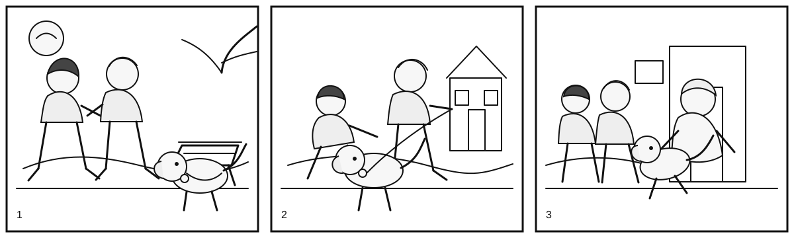

# A2 Key for Schools Writing Part 7 - Helping a Lost Dog

## Task

Look at the three pictures. Write the story shown in the pictures.

Write **100 words or more**.

## Sample Story

Last Friday, Emma and Leo were walking home from school when they saw a small dog near a bench in the park. The dog looked scared and hungry. Emma bent down and saw a name tag on its collar. It had an address on it, so the children decided to help.

They took the dog to the house on the tag and knocked on the door. An old woman opened it and smiled at once. She was very happy because the dog was hers. She thanked Emma and Leo for bringing him home. The children felt proud, and the dog happily jumped into her arms.

**Word count: 105**
