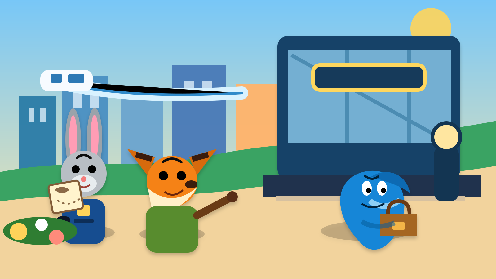
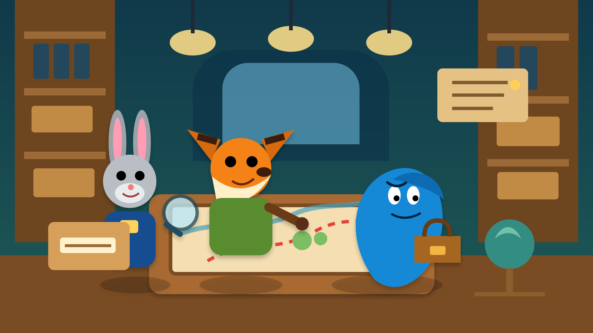
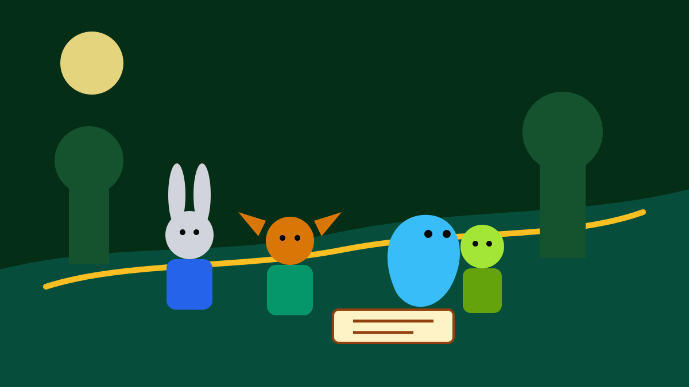

# Animal City 2 - 3-Part Story

This is an original, simplified A2-level animal-city mystery story. The pictures use original animal characters in a flat vector art style.

## Part 1 - A New Case

In a big animal city, a small rabbit police officer and a clever fox partner worked together. They were very different, but they were also good friends. The rabbit was quick and brave. The fox was funny and smart. Sometimes they did not agree, but they always tried to help each other.

One morning, they got a new case. A blue snake had come to the city, and many animals were afraid. Some people said the snake had taken an important notebook from an old animal family. Others said he was dangerous and should leave the city at once.

The rabbit officer wanted to catch him quickly. The fox partner wanted to ask more questions first. They followed a clue through busy streets, tall buildings, and a crowded market. At last, they saw the snake near a train station.

But the snake did not look angry. He looked worried. Before the rabbit and the fox could speak to him, another animal shouted for help. Suddenly, everyone thought the rabbit, the fox, and the snake had done something wrong.

## Part 2 - The Hidden Truth

The rabbit, the fox, and the snake ran away from the noisy crowd. They hid in an old part of the city. The streets there were quiet, and many buildings were closed. The snake told them his story.

He said his family had lived in the city long ago, but many animals had forgotten this. He wanted to find an old notebook because it could show the truth. The notebook had a map and some old names inside it. It could help his family return home.

The rabbit officer listened carefully. She was surprised because she had thought the snake was the problem. The fox partner looked at the map and found a strange sign. He knew that someone else was trying to hide the truth.

Soon, the three animals went into a dark building full of old papers, boxes, and glass lights. They found more clues there. The rabbit officer said, “Maybe we were wrong.” The fox smiled and said, “Then we need to be right now.” The snake looked hopeful for the first time.

## Part 3 - Back Home

The map led the three animals to a green place near the edge of the city. There were trees, old stones, and a small house by the water. The snake said this place was important to his family.

But another animal arrived first. He wanted to keep the old story secret. If everyone learned the truth, he would lose his power. He tried to take the notebook away. The rabbit officer stood in front of him. The fox partner helped her, and the snake protected the notebook.

Soon, more animals came. They saw the map, the notebook, and the old house. At last, they understood that the snake’s family had always been part of the city. The animals were quiet for a moment. Then one young animal said, “So they belong here too.”

The rabbit officer smiled. The fox partner said that a city was better when every animal had a place in it. The snake was happy because he could finally go home. The case was over, but the friendship between the three animals was only beginning.

## Useful A2 Words

- animal
- city
- officer
- partner
- snake
- case
- clue
- afraid
- crowded
- truth
- map
- family
- return
- protect
- friendship

## Reading Questions

1. Why were many animals afraid in Part 1?
2. What did the snake want to find?
3. Where did the map lead the animals in Part 3?
4. What did the animals learn at the end?

## Short Answers

1. Because a blue snake had come to the city, and some animals thought he was dangerous.
2. He wanted to find an old notebook with a map and old names inside it.
3. It led them to a green place near the edge of the city.
4. They learned that the snake's family had always been part of the city.
