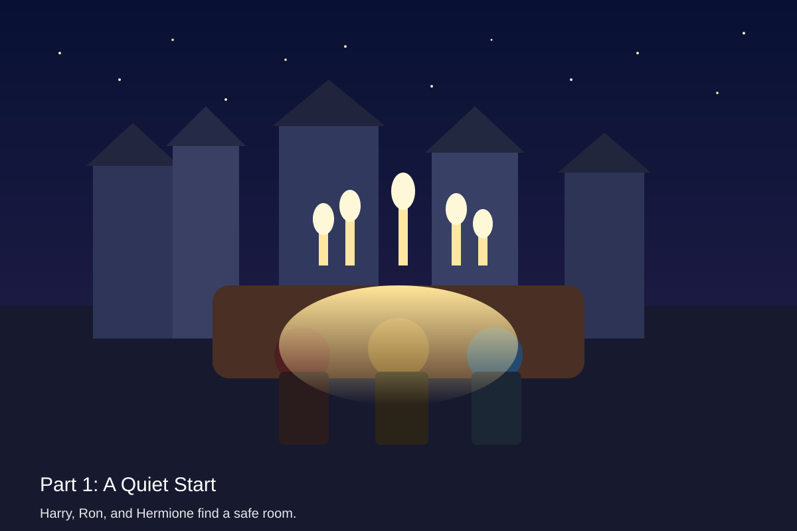
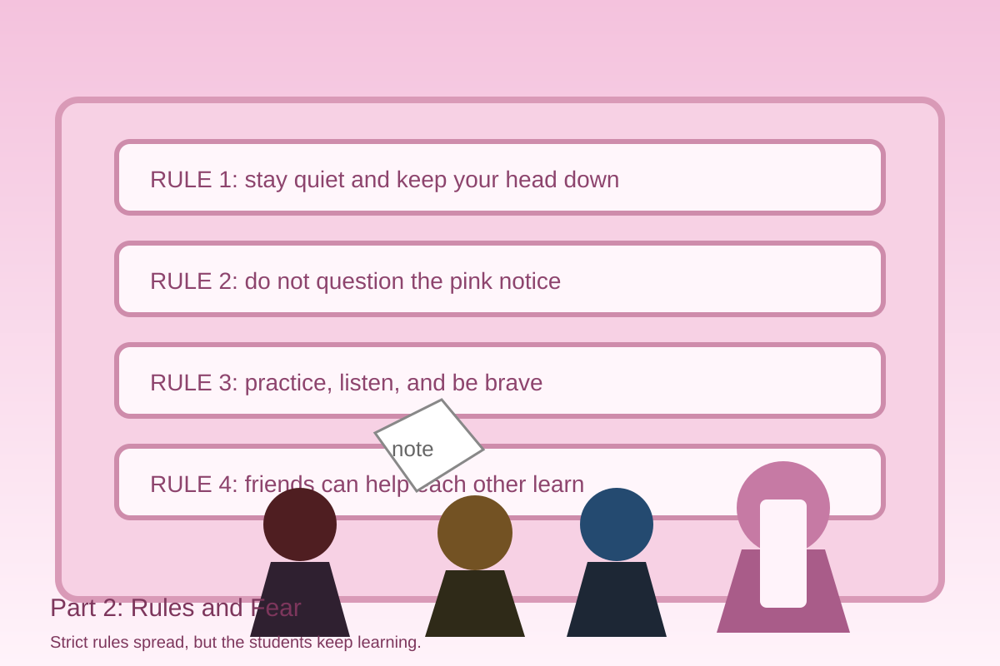
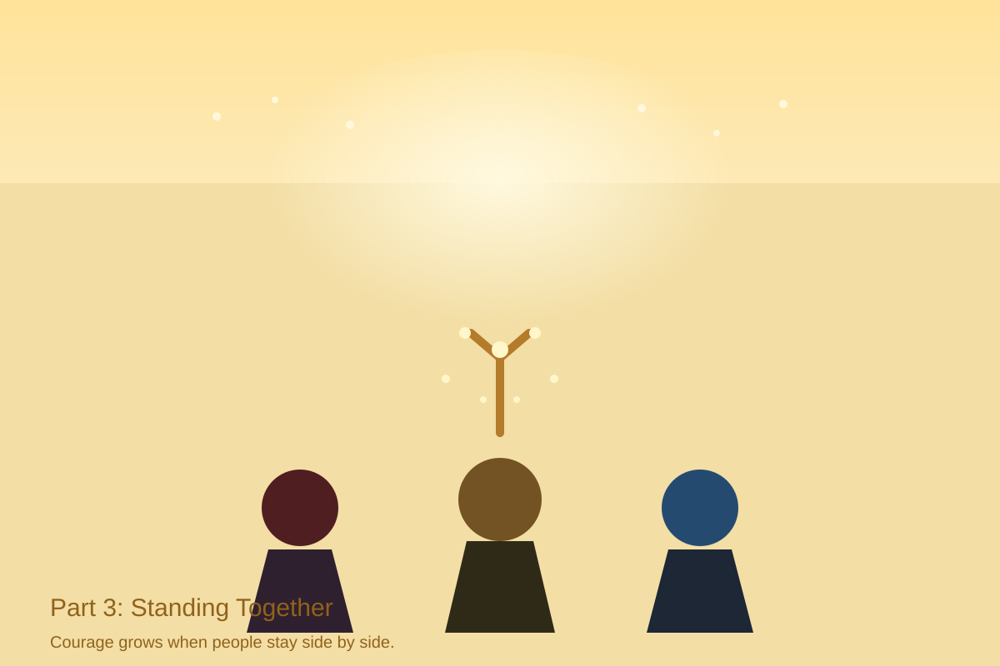

# Harry Potter and the Order of the Phoenix

## Part 1: A Quiet Start

Harry Potter came back to Hogwarts feeling tired and lonely. Many students had heard strange news, but they did not know what to believe. The castle felt colder than before. In the hall, people whispered and looked at Harry, then looked away again.

Harry met Ron and Hermione near the stairs. Ron gave him a small smile and said, “You are not alone.” Hermione nodded. She had a plan. “We need a safe place to talk,” she said. “A place where students can learn to protect themselves.”

That night, they walked through the dark halls and found the Room of Requirement. The door appeared when Harry needed it most. Inside, the room was empty at first, but then it changed into a warm place with chairs, candles, and space for books. Harry felt hope return to his chest.

He told the others that the school needed courage, not fear. Some students were shy. Some were nervous. But they listened. Harry did not speak like a hero from a book. He spoke like a friend who wanted to help. The students agreed to meet again and learn simple spells together.

Harry learned that a small group can become strong when people trust each other. It was only the first step, but it was an important one.

## Part 2: Rules and Fear

Soon, the school became harder. Professor Umbridge wrote strict rules on pink paper and pinned them everywhere. Students were told what to say, where to go, and even how to stand. The hallways felt full of warning signs. People lowered their voices and walked faster.

Harry hated the way fear spread through the castle. But he did not want to shout back. He wanted to help the students who were scared. So he met them again in the Room of Requirement. The room gave them a clean floor, soft light, and enough space for practice. Ron helped with one spell, and Hermione wrote clear notes on a board. Even Neville tried again after making a mistake.

Then a noise came from the corridor. Everyone froze. They heard footsteps and a sharp voice. The room went quiet like a held breath. Harry raised his hand and told the group to stay calm. They hid their books and stood still until the sound moved away.

After that, Harry looked at the faces around him. They were still nervous, but they were no longer alone. He saw courage growing in small steps. He understood that bravery was not only fighting. Sometimes bravery was staying steady when fear was trying to win.

## Part 3: Standing Together

One evening, the students gathered again. They were not perfect. Some still mixed up spells. Some still felt afraid. But they came back because they wanted to learn and because they trusted Harry. That trust was stronger than any rule on a wall.

Harry looked at the group and said, “We do not need to be the best. We only need to stand together.” The words were simple, but they felt true. The room warmed around them, as if it agreed.

Then a problem came. A message reached them that danger was close. Harry’s heart jumped, but he did not run away. He listened, thought, and chose a careful path. Ron stayed beside him. Hermione checked the facts. The younger students helped too, carrying notes and opening doors. Everyone had a small job.

By working as one team, they found a safer way forward. They did not remove every fear from the castle, but they proved something important: fear becomes smaller when people share it and face it together.

When the night ended, Harry felt tired, but he also felt proud. He learned that the Order of the Phoenix was not only a name. It was an idea. People can rise again when they choose trust, kindness, and courage.