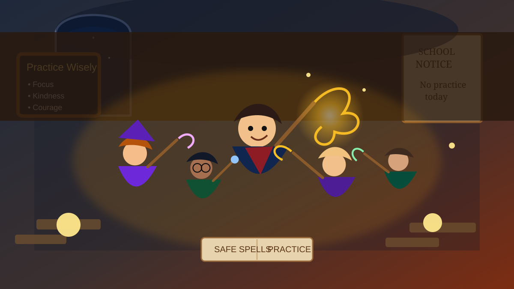

# Harry Potter and the Order of the Phoenix - 3-Part Story

This is an original, simplified A2-level story inspired by *Harry Potter and the Order of the Phoenix*. It is not an official Harry Potter text.

## Part 1 - A Strange Summer

Harry was staying with the Dursleys again, and the summer felt longer than ever. He had no news from his friends, and every day was quiet and boring. One evening, Harry walked through the streets near the park. The sky was grey, and the air suddenly became very cold.

Then something strange happened. Two dark creatures appeared near him. Harry knew they were dangerous. He quickly took out his wand and shouted a spell. A bright light came from the wand, and the creatures disappeared.

Soon after, Harry received a letter. It said he had used magic outside school and had to go to a hearing. Harry was worried. He did not want to leave Hogwarts forever.

That night, a group of witches and wizards came to take him away. They flew over London on broomsticks. At last, they arrived at a secret house. Inside, Harry saw Sirius, Hermione, and Ron. They told him about a group called the Order of the Phoenix.

**Image idea:** A teenage wizard flying on a broomstick over London at night with a small group of witches and wizards, dark blue sky, city lights below, magical but child-friendly style.

## Part 2 - Lessons and Secrets

Harry returned to Hogwarts, but school was very different this year. A new teacher, Professor Umbridge, came to teach Defence Against the Dark Arts. She wore pink clothes and smiled a lot, but she was not kind. She did not let students practise real magic. They only read from books.

Many students believed Harry, but some did not. Harry felt angry and alone. Hermione had an idea. She said Harry should teach the other students how to protect themselves. At first, Harry was not sure, but Ron and Hermione helped him.

They made a secret group called Dumbledore's Army. The students met in a hidden room at school. Harry taught them useful spells. Everyone worked hard, and the room was full of hope.

But Harry was also having strange dreams. In one dream, he saw a dark place and a door. He felt that something important was hidden there. He did not understand why these dreams were happening, but he knew they were connected to Voldemort.

**Image idea:** A secret classroom in a magical school, young students practising safe glowing spells together, old stone walls, warm light, books and school bags, child-friendly fantasy style.

## Part 3 - The Ministry Adventure

One night, Harry had a terrible dream. He thought Sirius was in danger at the Ministry of Magic. Harry wanted to help him at once. Hermione and Ron tried to be careful, but Harry was afraid there was no time.

Harry and his friends went to the Ministry. The building was dark and quiet. They found a room full of glass balls. One ball had Harry's name on it. Then some dangerous people appeared. Harry understood it was a trap.

The friends acted bravely. They used the spells Harry had taught them, but the other group was strong. Soon, members of the Order of the Phoenix arrived to help. The room became full of light, noise, and magic.

Harry lost someone he loved, and he felt very sad. Later, Dumbledore told Harry more about the connection between him and Voldemort. Harry learned that growing up could be painful, but he was not alone. His friends, his teachers, and the Order would stand with him.

**Image idea:** A dark magical hall with shelves of glowing glass balls, brave young wizards standing together with wands, soft magical light, dramatic but not scary, child-friendly fantasy style.

## Useful A2 Words

- strange
- dangerous
- secret
- group
- practise
- dream
- afraid
- brave
- arrive
- alone
- teacher
- friends
- magic
- school
- lesson

## Reading Questions

1. Why was Harry worried after he used magic outside school?
2. Why did Hermione think Harry should teach the other students?
3. Where did Harry and his friends go in Part 3?
4. What did Harry learn at the end of the story?

## Short Answers

1. Because he had to go to a hearing and he was afraid he might leave Hogwarts.
2. Because the new teacher did not let them practise real magic.
3. They went to the Ministry of Magic.
4. He learned that growing up could be painful, but he was not alone.
