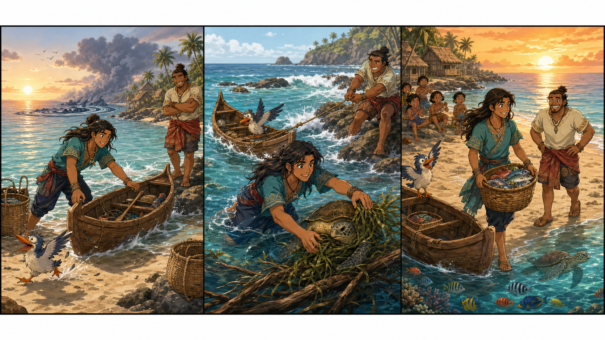

# Moana and the Small Wave

## Part 1: The Calm Sea

Moana woke up early on Motunui. The sky was pink, and the sea was quiet. She walked to the beach and looked at the water. She loved the ocean because it felt alive and kind. On this morning, Moana wanted to help her island in a small way. Some fish were not coming near the shore, and the village baskets were getting empty.

Moana took her canoe and called, “Hei Hei, come with me.” The little chicken ran after her, but he slipped in the sand and made a funny noise. Moana smiled. She did not want to go far. She only wanted to find fresh fish near the reef.

Maui was nearby, sitting on a rock and watching the waves. He laughed and said, “This looks easy for a hero like me.”

Moana shook her head. “Today is not about big words. It is about help.”

She pushed the canoe into the water and paddled slowly. The sea was smooth at first. Then she saw a small dark cloud over the reef. The water moved in a strange way. Moana felt a little afraid, but she stayed calm.

## Part 2: The Lost Canoe

Moana reached the reef and saw the problem. A young turtle was stuck near some sea grass. The grass was caught on a broken piece of wood. The turtle could not move well, and the small fish around it were scared.

Moana said, “It is okay. I will help you.”

She got into the water and pulled the grass gently. But then a small wave pushed the canoe away from her. The canoe turned and drifted toward the rocks.

“Oh no!” Moana cried.

Maui jumped up. “I can fix this fast!” he said.

He used his hook and tried to pull the canoe back. At first, he pulled too hard, and the canoe spun in a circle. Hei Hei flapped his wings and shouted in his own silly way. Moana almost laughed, but she kept working.

Then she had an idea. She told Maui to pull only a little. She told Hei Hei to stay still. Moana swam to the canoe, held the side, and guided it away from the rocks. The small wave became gentle again.

Together, they reached the turtle. Moana freed it at last. The turtle moved into the blue water and swam away happily.

## Part 3: A Better Day

After that, the fish came back near the reef. Moana and Maui watched them swim in shining groups. The sea was calm again.

Maui looked at Moana and said, “You were the real hero today.”

Moana smiled. “We were a team.”

She returned to the village with a full basket of fish. The people were happy, and the children ran to the beach to see her canoe. Moana told them about the turtle and the small wave. Everyone listened closely.

That evening, Moana sat near the water and thought about the day. She had not saved the whole world. She had only helped one turtle, one canoe, and one small problem. But she learned something important: small help can make a big difference.

The sea moved softly under the moon. Moana felt proud, not because she was the strongest, but because she was kind, brave, and ready to try.

## Useful A2 Words
- beach
- canoe
- calm
- help
- small
- brave
- kind
- wave
- fish
- team

## Reading Questions
1. Where does Moana go in the morning?
2. What problem does Moana see near the reef?
3. What lesson does Moana learn?

## Short Answers
1. She goes to the beach and the sea.
2. She sees a turtle stuck near sea grass.
3. She learns that small help can make a big difference.