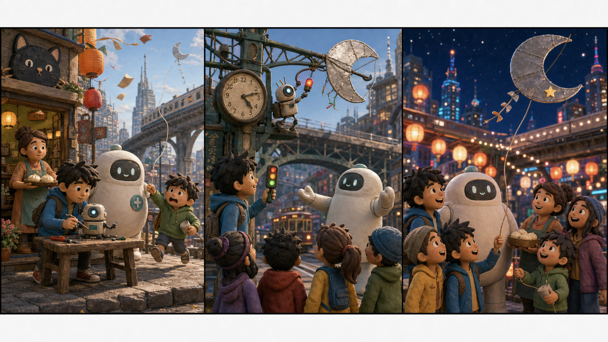

# Big Hero 6: The Moon Kite Rescue

## Part 1: A Windy Afternoon

Hiro sat in the Lucky Cat Cafe with a small robot on the table. The robot had two tiny arms and one bright eye. It could pick up sugar cubes and put them in a line.

"Not bad," Hiro said. "But you still need better balance."

Baymax stood beside him. "Balance is important for health."

Aunt Cass came from the kitchen with warm buns. "Balance is also important for carrying plates," she said.

Then the door opened fast. A little boy ran in. His name was Kenji, and he was holding a broken kite string.

"Please help!" Kenji said. "My moon kite flew away. It is for the night festival. My sister made it."

Hiro looked through the window. The wind was strong, and paper lanterns moved above the street.

"Where did it go?" he asked.

Kenji pointed toward the high train bridge. "It got stuck near the old clock sign."

Baymax looked at the boy's sad face. "You need help and comfort."

Hiro put his robot in his bag. "Then we are going for a walk."

## Part 2: The Clock Sign

Go Go, Wasabi, Honey Lemon, and Fred met them near the train bridge. The moon kite was high above the street. Its silver paper was caught on a metal hook.

"We cannot climb there," Wasabi said. "It is not safe."

"And the train comes in ten minutes," Go Go said.

Hiro opened his bag. "My little robot can climb the sign."

The robot walked up the wall, but the wind pushed it back. It fell into Baymax's soft arms.

"No injury," Baymax said.

Hiro frowned. "It needs a signal. The wind is too loud for my phone."

Honey Lemon took out a small round light. "Use this. It can flash colors."

Hiro smiled. "Great idea."

He fixed the light to the robot. Blue meant go up. Yellow meant stop. Green meant pull the string.

The robot climbed again. This time, everyone watched carefully. Kenji held his breath.

"Blue," Hiro said.

The robot moved higher.

"Yellow."

It stopped near the kite.

"Green."

The small arms pulled the string free. The moon kite fell, and Baymax opened his arms like a soft white net. The kite landed safely.

## Part 3: The Night Festival

Kenji ran to the kite. One corner was torn, but the moon shape was still beautiful.

"My sister will be sad," he said.

"Maybe not," Honey Lemon said. She opened her bag and found silver tape and a tiny star sticker.

Wasabi held the kite still. Go Go cut the tape. Fred told Kenji a funny story about a dragon kite that wanted pizza. Soon Kenji laughed again.

Hiro used his small robot to press the star sticker onto the torn corner.

"Now it looks special," Kenji said.

That night, the festival began. Lanterns shone over San Fransokyo. Kenji's moon kite flew above the bridge, and the little star on the corner flashed in the light.

Baymax stood beside Hiro and watched the sky.

"Your small robot helped someone feel better," Baymax said.

Hiro nodded. "It still needs better balance."

"Yes," Baymax said. "But today it had a good heart."

Hiro smiled. He knew a machine did not need to be big to help people. Sometimes a tiny robot, a clear signal, and a few good friends were enough.

## Useful A2 Words

- **balance**: the way something stays steady and does not fall.
- **signal**: a sound, light, or sign that gives information.
- **carefully**: in a safe and slow way.

## Reading Questions

1. What did Kenji lose before the night festival?
2. Why did Hiro use the flashing light?
3. How did the friends fix the kite?

## Short Answers

1. He lost his moon kite.
2. He used it to send signals to the small robot.
3. They used silver tape and a tiny star sticker.
