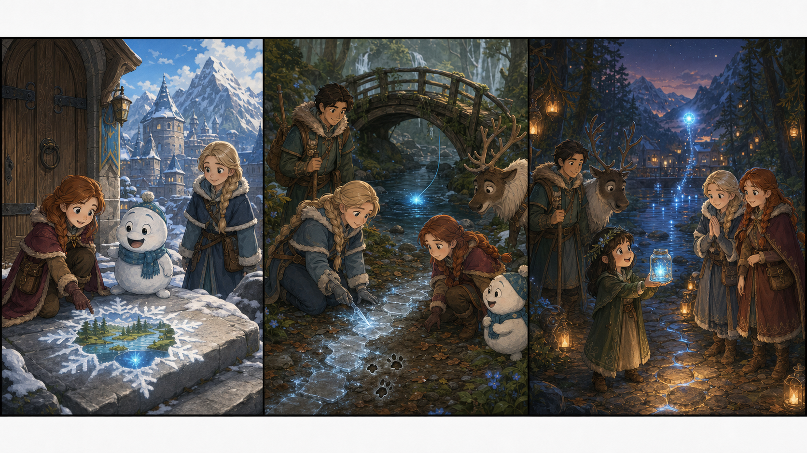

# Frozen II: The Quiet River Light

## Part 1: A Small Problem

Anna opened the castle door and saw a soft snowflake on the step. It was not winter in Arendelle, so she knew it was a message from Elsa.

The snowflake turned into a tiny picture. It showed the Enchanted Forest, a river, and a little light under the water.

"Elsa needs us," Anna said.

Olaf ran into the hall with a book on his head. "Good! I was ready for a walk."

Kristoff brought Sven to the gate. Soon Anna, Olaf, Kristoff, and Sven rode toward the forest. The trees were green and quiet. When they arrived, Elsa was standing near the river with a Northuldra girl named Liva.

Liva held an empty glass jar. "Every year, my family puts a river light in this jar," she said. "It helps us find the safe path at night. But the light is gone."

Elsa looked at the dark water. "I can feel it," she said. "It is still near us, but it is scared."

Anna touched Liva's shoulder. "Then we will help it feel safe."

## Part 2: Under the Old Bridge

The friends walked beside the river. Olaf looked into every hole in the snow-white stones.

"If I were a river light," he said, "I would live somewhere bright and warm."

Near an old wooden bridge, Sven stopped. He pushed his nose toward some wet leaves. Anna moved the leaves and found small marks in the mud.

"These are tiny steps," Anna said. "Maybe the light moved here."

Elsa made a gentle ice path across the river. She did not cover the water. She only made a safe place for everyone to stand. Under the bridge, they heard a soft sound. It was like a bell far away.

Liva got down on her knees. "I made a promise to my grandmother," she said.

A small blue glow came from behind a stone. Olaf waved slowly.

"Hello, little light. We are not here to catch you. We are here to listen."

The glow moved closer. Then they saw it. The river light was caught in a silver line. It could not swim back to deep water.

Anna pulled the line away. Elsa used a little ice to open the knot. Kristoff held the jar open.

"You can choose," Anna said softly.

The light floated into the jar by itself.

## Part 3: The Night Path

That evening, the forest became dark. Liva carried the jar to the river path. The blue light shone on the stones.

Liva smiled. "Now my grandmother can come to the fire circle safely."

Anna felt happy. "You kept your promise."

Liva shook her head. "We all kept it."

Olaf looked at the bright jar. "A light is small, but it can still lead many feet."

"That is a nice thought," Elsa said.

Kristoff laughed, and Sven made a happy sound.

Later, the Northuldra people sang near the fire. Elsa watched the river light move inside the jar. She knew magic was not only about power. Sometimes magic needed courage and careful hands.

Anna stood beside her sister. "Good day?"

Elsa smiled. "A very good day."

The river light rose from the jar and flew over the water. It was free, but it stayed close to the path. Liva waved to it.

The forest was dark, but no one was afraid. The little blue light showed the way home.

## Useful A2 Words

- **promise**: something you say you will do.
- **gentle**: kind and careful.
- **courage**: being brave when something is hard.

## Reading Questions

1. What message did Anna find at the castle door?
2. Where did the friends find the river light?
3. What did Elsa learn about magic?

## Short Answers

1. She found a snowflake message from Elsa.
2. They found it under an old wooden bridge.
3. She learned that magic can need courage, a quiet voice, and careful hands.
