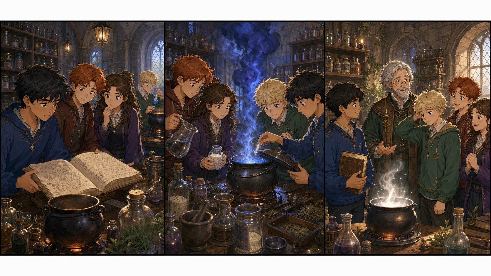

# Harry Potter and the Half-Blood Prince: The Quiet Potion Lesson

## Part 1: The Old Book

Harry Potter sat in Professor Slughorn's Potions classroom with Ron and Hermione. The room was warm, and the air smelled of herbs and smoke. Each student had a black cauldron. Today they had to make a silver sleeping potion for Madam Pomfrey.

Harry opened the old book that Slughorn had given him. It was full of small notes from a person called the Half-Blood Prince. Some notes were helpful, but Hermione did not like them.

"Be careful, Harry," she said. "You do not know who wrote those words."

Harry nodded. He wanted to win Slughorn's praise, but he also wanted to do the right thing.

Across the room, Draco Malfoy worked alone. His face was pale. He looked tired, and his hand shook when he picked up a bottle of blue powder.

## Part 2: The Blue Smoke

Suddenly, Draco's bottle fell. Blue powder flew into his cauldron, and the potion rose like a small wave. It hissed loudly. Dark smoke filled the air, and several students moved back.

Ron held his nose. "That does not look friendly."

Hermione opened her book. "Cold water will make it worse," she said quickly.

Harry looked at the old Potions book. A note in the margin said, "When silver sleeps too fast, warm water and moonstone dust can calm it."

Harry stopped for a second. The note might be right, but it might also be dangerous. Then he saw Draco's face. Draco looked afraid.

"I didn't mean to," Draco said quietly.

Harry decided to help, not fight. "Ron, get warm water. Hermione, check the moonstone dust. Draco, hold the lid, but do not close it."

They moved quickly. Ron carried a jug of warm water. Hermione checked the label twice. Draco held the lid with both hands. Harry added the dust very slowly.

The smoke changed from dark blue to soft white. The cauldron stopped shaking. Everyone in the room became quiet.

## Part 3: A Quiet Lesson

Professor Slughorn hurried back from the cupboard. For a moment he looked shocked. Then he smiled.

"Well done," he said. "That could have made quite a mess."

He gave Harry and Hermione five points each. Ron looked pleased, although he had only carried water. Then Slughorn looked at Draco.

"You stayed and helped," he said. "That was sensible."

Draco did not smile, but he gave a small nod. As he passed Harry, he said, "Thanks."

Harry was surprised. "It's all right," he answered.

Later, in the corridor, Hermione pointed at the old book. "The note helped today, but you still had to choose what to do."

Harry looked down at the cover. The Half-Blood Prince was still a mystery. The book had clever ideas, but Harry understood something important. Magic was not only about being quick or strong. Sometimes it was about staying calm, listening to friends, and helping someone you did not like.

At dinner, Ron told the story twice. Hermione corrected him twice. Harry laughed and felt a little lighter.

## Useful A2 Words

- **potion**: a magic drink.
- **careful**: doing something with attention.
- **sensible**: showing good judgement.

## Reading Questions

1. What did the students have to make in Potions class?
2. What happened to Draco's bottle?
3. What did Harry learn at the end?

## Short Answers

1. They had to make a silver sleeping potion.
2. It fell, and blue powder went into Draco's cauldron.
3. He learned that magic can mean staying calm and helping someone.
