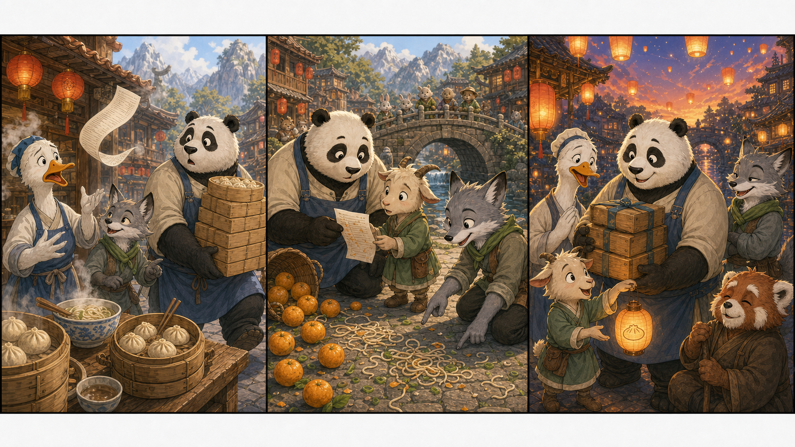

# Kung Fu Panda 4: The Quiet Dumpling Lesson

## Part 1: A Busy Morning

Po woke up early in the Valley of Peace. The sun was bright, and the village was already busy. It was the day of the lantern festival, and everyone wanted noodles, dumplings, and sweet tea.

Mr. Ping ran around the noodle shop with a long list in his wing. "Po, I need help!" he cried. "The festival starts soon, and I must send food to three places."

Po smiled. "Do not worry, Dad. The Dragon Warrior is ready."

Zhen sat on the roof and ate one dumpling. "Ready to carry boxes?" she asked.

"Ready to carry boxes with honor," Po said.

Master Shifu walked by with his hands behind his back. "A leader does not only fight," he said. "A leader also listens."

Po nodded, but he was thinking about the dumplings. Then a small wind blew through the shop. The order list flew out of Mr. Ping's wing and into the busy street.

## Part 2: The Lost List

Po jumped after the paper, but he was too large for the crowded street. He bumped into a basket of oranges. The oranges rolled everywhere, and two little rabbits laughed.

"Sorry!" Po said. He picked up the oranges, but the list was gone.

Zhen climbed down and looked at the ground. "There are noodle drops here," she said. "Someone stepped in soup."

"That is a clue," Po said. He tried to look serious.

They followed the drops to the bridge. There they found a young goat holding the list. He looked worried.

"I wanted to help," the goat said. "But I cannot read all the words."

Po took the list carefully. He was ready to run back, but Zhen stopped him.

"Wait. He wanted to help. Maybe we can help him too."

Po remembered Shifu's words. A leader listens. So he sat beside the goat and read the list slowly. The goat smiled and pointed to the first house.

"That one needs dumplings with no onions," he said.

"Good eyes," Zhen said.

Together, they carried the food. Po carried the heavy boxes. Zhen moved fast through the crowd. The goat checked each house. No one got the wrong meal.

## Part 3: The Best Lantern

When the sun went down, the lanterns lit the street. Mr. Ping looked at the empty boxes and gave a happy sigh.

"All the food arrived!" he said. "My shop is saved."

Po rubbed his stomach. "And I only ate two dumplings by accident."

Zhen raised an eyebrow. "Three."

Master Shifu smiled a little. "Today you did not win with a kick. You won with patience."

The young goat gave Po a small paper lantern. It had a picture of a dumpling on it.

"Thank you for listening," the goat said.

Po held the lantern carefully. He felt proud, but not in a loud way. He had learned that being a leader was not only about being strong or famous. Sometimes it meant slowing down, hearing a small voice, and making space for someone who wanted to help.

That night, Po, Zhen, Shifu, and Mr. Ping watched the lanterns float into the dark sky. Po smiled at his dumpling lantern.

"This," he said, "is the most delicious lesson ever."

## Useful A2 Words

- **leader**: a person who guides others.
- **patient**: able to wait calmly.
- **clue**: something that helps you find an answer.

## Reading Questions

1. What day was it in the Valley of Peace?
2. Who found the lost order list?
3. What did Po learn about being a leader?

## Short Answers

1. It was the day of the lantern festival.
2. A young goat found the lost order list.
3. He learned that a leader listens and helps others.
