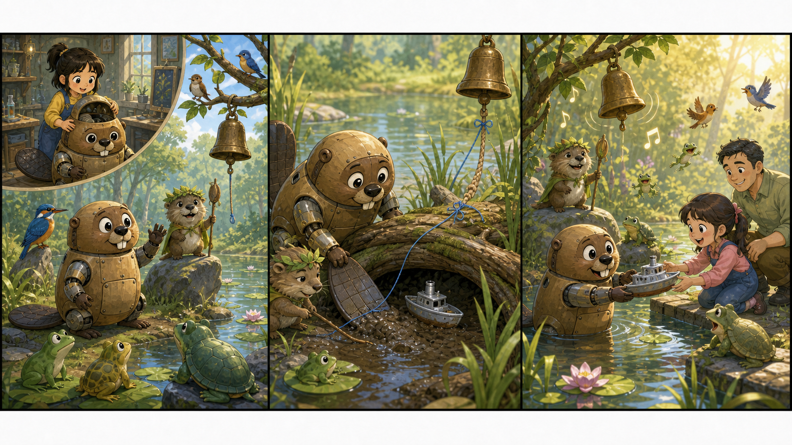

# Hoppers: The Quiet Pond Bell

## Part 1: A New Sound

Mabel sat in the small lab and looked at the beaver robot body. The eyes blinked once. The tail moved left, then right.

"Ready?" Dr. Sam asked.

Mabel smiled. "Ready to hop."

A soft light filled the room. A moment later, Mabel opened her eyes near the pond. She was inside the robot beaver, and she could hear the animals clearly.

King George stood on a flat rock. He wore a leaf like a tiny crown.

"Good," he said. "You are here. We have a problem."

Mabel looked around. Birds sat quietly in the trees. Frogs did not sing. Even the insects were still.

"What happened?" she asked.

King George pointed to the tall grass. "Every morning, the pond bell rings. It tells everyone the water is safe. Today there was no bell."

Mabel saw a small wooden bell hanging from a branch. It was not broken, but it did not move.

"Maybe the wind stopped," she said.

"The wind never stops being rude," King George said. "So this is strange."

## Part 2: The Muddy Path

Mabel followed King George along the pond. The mud was soft, and her robot feet made funny sounds.

"Sorry," she said.

"That is a normal beaver sound," King George said. "Try to look proud."

Near the reeds, they found a thin blue string. It was tied around the bell rope and ran into the water.

"This is a clue," Mabel said.

A small turtle lifted his head from the mud. "I saw something silver last night," he said. "It went under the old log."

Mabel and King George swam to the log. Under it, they found a lost toy boat. The blue string was caught on its wheel. Each time the water moved, the boat pulled the bell rope down. The bell could not swing.

"A human child may have lost this," Mabel said.

King George frowned. "Then humans are loud even when they are not here."

Mabel touched the boat carefully. "Maybe we can fix the problem and return the boat."

She used her flat robot tail to push the boat out of the mud. King George chewed a small stick and used it like a tool. Together, they freed the string.

At once, the bell moved in the wind.

Ding.

The birds sang. The frogs jumped. The pond felt awake again.

## Part 3: A Small Gift

Mabel carried the toy boat to the edge of the pond. A little girl was walking there with her father. She looked sad.

"My boat is gone," the girl said.

Mabel could not speak to her as a human, but she could help. She pushed the boat out of the grass.

The girl gasped. "There it is!"

King George hid behind a stone. "Good work," he whispered. "Very quiet. Very royal."

The girl picked up the boat. Then she saw the blue string was gone. She found a small leaf tied in its place.

"A beaver helped me," she said.

Her father smiled. "Then we should keep the pond clean."

Mabel felt warm inside the robot body. The animals watched from the trees and reeds.

King George climbed onto his rock again. "The bell is safe. The boat is home. The pond is clean. I call this a fine morning."

The bell rang once more.

Ding.

Mabel laughed. She had learned that helping animals did not always mean doing a big, brave thing. Sometimes it meant listening to a quiet pond, following one small clue, and fixing a tiny problem before it became a big one.

## Useful A2 Words

- **clue**: something that helps you find an answer.
- **royal**: about a king or queen.
- **brave**: ready to do something hard or scary.

## Reading Questions

1. Why did King George ask Mabel for help?
2. What stopped the pond bell from moving?
3. What did the girl and her father decide to do?

## Short Answers

1. The pond bell did not ring that morning.
2. A blue string from a lost toy boat stopped it.
3. They decided to keep the pond clean.
