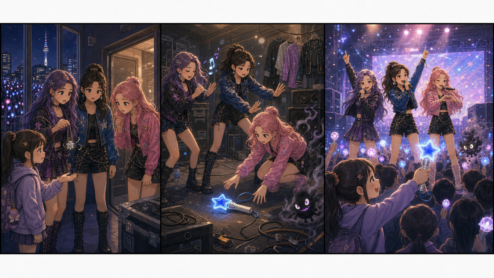

# KPop Demon Hunters: The Quiet Light Stick

## Part 1: Before the Show

Rumi, Mira, and Zoey arrived at the concert hall early. Their group, HUNTR/X, had a big show that night. Outside, fans were already singing and holding bright light sticks.

Zoey looked through the window and smiled. "They know every word."

"Then we must give them a good show," Mira said.

Rumi opened her bag. Inside were her microphone, a small mirror, and a silver charm. The charm helped her hear strange sounds. Tonight, it was shaking.

"Something is wrong," Rumi said.

Just then, a young fan came to the backstage door. Her name was Mina. Her eyes were wet.

"I lost my light stick," Mina said. "My grandmother gave it to me. It has a blue star on the handle."

Zoey knelt beside her. "We will look for it."

Mira listened to the hall. "And I hear something else."

From the stage speakers came a tiny whisper. It said, "Too late. Too late."

Rumi held the silver charm. "That is not a normal sound."

The three girls looked at each other. They were singers, but they were also demon hunters. The show had not started, but their work had.

## Part 2: The Whisper Room

The girls followed the whisper down a small hallway. It led them to a quiet room behind the stage. Old wires hung on the wall, and boxes of costumes stood in the corner.

Mina's light stick was on the floor. Its blue star was dark.

"There it is," Zoey said.

When she reached for it, a little black demon jumped from behind a speaker. It was small, but its voice was sharp.

"No happy songs tonight!" it cried. "I will make every fan feel nervous."

The demon blew cold air at the light stick. The blue star flickered.

Mira stepped forward. "You picked the wrong room."

The demon laughed and hid inside the speaker. The lights blinked. A low sound filled the room.

Rumi covered her ears. "It is using the sound system."

Zoey took out a small notebook. "Then we use a better sound."

She tapped a beat on a costume box. Mira clapped softly. Rumi sang one clear note. The room became warmer.

The demon came out of the speaker. It looked smaller now.

"Stop that song!" it shouted.

Mira moved fast and closed the speaker door. Zoey picked up the light stick. Rumi touched it with the silver charm.

The blue star shone again.

## Part 3: One Small Light

The girls brought the light stick back to Mina. She held it with both hands.

"Thank you," she said. "I was scared."

"It is okay to feel scared," Rumi said. "You still came to the show."

Mira smiled. "That is brave."

The concert began a few minutes later. The hall became dark. Then thousands of lights turned on. Mina's blue star was small, but Rumi saw it from the stage.

The whisper demon tried one last time. It made a soft sound under the music.

Zoey heard it first. She changed one line of the song and sang about courage. Mira danced closer to Rumi, and Rumi lifted her microphone.

The fans sang with them. Mina held up her light stick. The blue star grew bright, and the demon sound broke like thin glass.

After the show, Rumi looked at the empty stage.

"One small light helped many people," she said.

Zoey laughed. "And one small demon learned not to touch fan gifts."

Mira picked up her jacket. "Good. Now can we eat?"

The three girls smiled and walked out together. They had protected the fans, saved the show, and learned that even a quiet light could be strong.

## Useful A2 Words

- **backstage**: the area behind a stage.
- **nervous**: worried or afraid before something happens.
- **protect**: to keep someone safe.

## Reading Questions

1. What did Mina lose before the concert?
2. Where did the little demon hide?
3. How did the fans help HUNTR/X at the end?

## Short Answers

1. She lost her light stick with a blue star.
2. It hid inside a stage speaker.
3. They sang with HUNTR/X and held up their lights.
