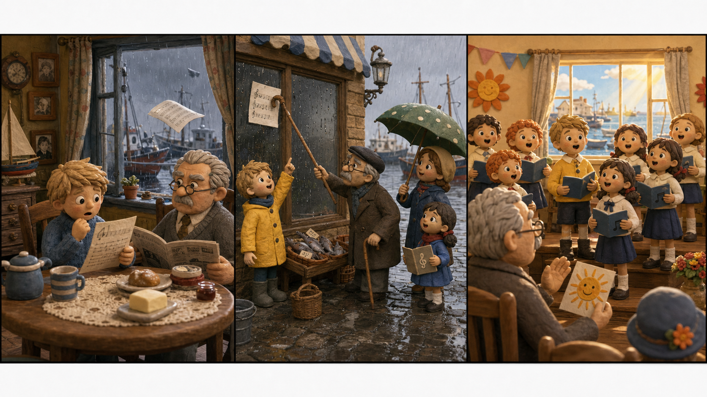

# Heintje: The Harbor Window

## Part 1: A Rainy Morning

Heintje woke up in his grandfather's house near the harbor. Rain tapped on the window. The boats outside looked gray and quiet.

His grandfather, Mr. Berthold, sat at the breakfast table. He read a newspaper and did not smile.

"The school concert is today," Heintje said. "Can we go?"

Mr. Berthold looked at the rain. "A concert in this weather? People will stay home."

Heintje did not answer. He knew his grandfather was kind inside, but he often hid it behind a cold face.

Then the housekeeper, Marta, came in with a wet coat. "A letter came from the harbor school," she said. "But the wind took one page away."

Heintje picked up the letter. The concert was not only for fun. The children wanted to buy new books for their classroom. The lost page had the list of songs and the time of the show.

"If people do not know the time, they will not come," Heintje said.

Mr. Berthold folded his newspaper. "That is a problem for the school."

Heintje looked at the window. "Maybe it can be our problem too."

## Part 2: The Missing Page

Heintje put on his raincoat and ran to the harbor. Marta came with him, holding a large umbrella.

The wind pushed hard. A baker pointed to the fish market. "I saw a white paper fly that way!"

At the market, Heintje heard a small girl crying. Her name was Lotte. She was from the school choir.

"We cannot sing," Lotte said. "No one knows when to come."

Heintje smiled. "Then we will find the page."

They looked under boxes, behind baskets, and near the old boats. At last, Heintje saw something white on a wet window. It was stuck to the glass of a closed shop.

"There!" he said.

The page was too high. Marta could not reach it. Lotte tried to climb a box, but it moved.

Then Mr. Berthold arrived with his driver. He held a long walking stick.

"This is not safe," he said. "Stand back."

He used the stick carefully and pulled the paper down. It was wet, but the words were still clear.

Heintje looked at his grandfather. "You came."

Mr. Berthold coughed. "The rain was too loud at home."

But Heintje saw a small smile.

## Part 3: The Sun Returns

At three o'clock, the school hall was full. Mr. Berthold had asked his driver to tell people at the harbor, the market, and the bakery. Marta dried the page by the stove.

The children stood on the small stage. Lotte was nervous, so Heintje stood beside her.

"Just look at the window," he whispered.

Outside, the rain stopped. A line of sunlight came through the clouds and touched the harbor water.

Lotte smiled. The choir began to sing. Heintje joined them, and the room became warm with music.

Mr. Berthold sat in the back row. At first, his hands stayed on his knees. Then he began to clap softly.

After the concert, the teacher held a box of coins. "We have enough money for the books," she said.

Lotte gave Heintje a small paper sun. "For finding the page," she said.

Heintje gave it to his grandfather.

"For coming in the rain," he said.

Mr. Berthold looked at the paper sun for a long time. "Perhaps," he said, "the sun does come back."

Heintje smiled. Outside, the harbor windows shone like gold.

## Useful A2 Words

- **harbor**: a place where boats stay near land.
- **choir**: a group of people who sing together.
- **nervous**: worried before doing something.

## Reading Questions

1. What page was lost in the wind?
2. Who helped Heintje get the page down from the window?
3. What did Lotte give to Heintje after the concert?

## Short Answers

1. The page with the song list and concert time was lost.
2. Mr. Berthold helped him with his walking stick.
3. She gave him a small paper sun.
