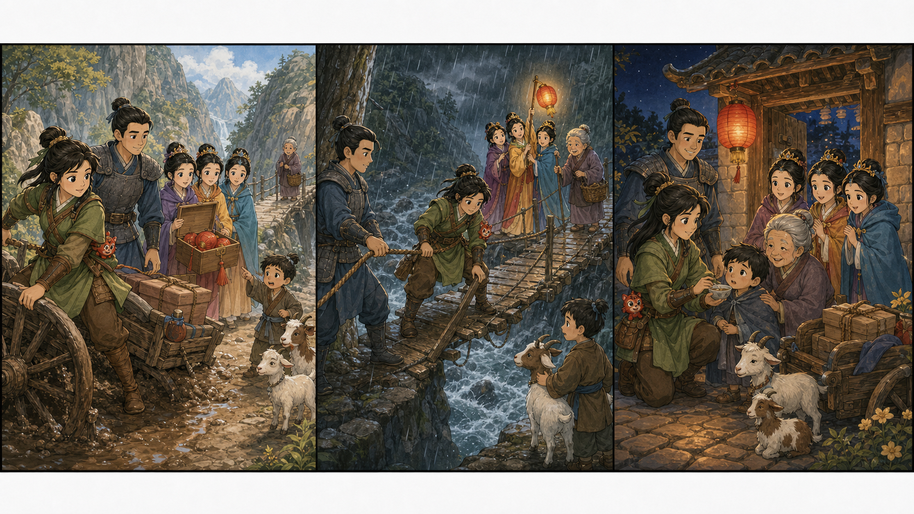

# Mulan II: The Bridge Lantern

## Part 1: A Quiet Road

Mulan and Shang rode at the front of the small group. The road was narrow, and the mountains stood high. Behind them, the three princesses sat in a cart with boxes of gifts.

Mushu sat inside Mulan's sleeve. "I am watching everything," he whispered. "Mostly snacks."

Mulan smiled, but she kept her eyes on the road. They were carrying an important message for the Emperor.

Then the cart stopped. One wheel was stuck in mud.

Princess Ting-Ting looked at the sky. "Dark clouds are coming."

Princess Mei jumped down. "We can push."

Princess Su opened one of the gift boxes. "There are lanterns here. Maybe we can use them later."

Shang checked the wheel. "The road is too wet. If we hurry, we may break the cart."

Mulan looked at a small bridge ahead. It crossed a fast river. A village boy stood there with two goats. He looked worried.

"The bridge is shaking," the boy said. "My grandmother is on the other side, and she cannot cross."

Mulan looked at Shang. The message was important, but the grandmother needed help now.

"We help first," Mulan said.

## Part 2: Across the Water

Rain began to fall. The old bridge moved in the wind. The goats cried.

Shang tied a strong rope to a tree. "We need a safe line."

Mulan walked onto the bridge slowly. She tested each board with her foot.

Mushu peeked out from her sleeve.

"I am brave," he said. "But I am also very small."

Mulan laughed softly. "Then stay small and useful."

On the other side, the grandmother stood under a tree. She was holding a basket of medicine.

Princess Su took a red lantern from the gift box. Princess Mei lit it. Princess Ting-Ting held it high.

"She can follow the light," Ting-Ting said.

Mulan waved. "Come slowly. Look at the lantern."

The grandmother stepped onto the bridge. Shang held the rope. The princesses held the lantern. The boy stayed calm and held the goats.

One board cracked.

Mulan moved fast and put her own foot on a stronger board. "Step here," she said.

The grandmother followed. Soon she reached the road safely. The boy hugged her.

## Part 3: The Bright Choice

The rain stopped. Everyone was wet and tired.

The grandmother opened her basket. "This medicine is for the next village," she said. "A child there is sick."

Mulan and Shang looked at each other. Now there was another need.

Princess Mei smiled. "We have three horses."

Princess Ting-Ting nodded. "And we have a lantern."

Princess Su held the red lantern. "The road is dark, but we can make it bright."

Shang made a plan. Mulan rode ahead with the medicine. The princesses followed with the lantern.

At the next village, the sick child got the medicine. The Emperor's message arrived late, but safely.

That night, Mulan put the red lantern near the village gate. Its light moved softly in the wind.

Shang stood beside her. "You chose the harder road."

Mulan looked at the lantern. "Sometimes the right road is harder."

Mushu climbed onto the lantern pole. "And sometimes it has no snacks."

Everyone laughed. The red lantern shone over the bridge road, showing the way for anyone who needed help.

## Useful A2 Words

- **message**: words sent from one person to another.
- **medicine**: something that helps a sick person get better.
- **calm**: quiet and not afraid.

## Reading Questions

1. Why did Mulan and Shang stop near the bridge?
2. What helped the grandmother cross the bridge?
3. What did Mulan take to the next village?

## Short Answers

1. They stopped because a boy's grandmother could not cross the shaking bridge.
2. A red lantern and a strong rope helped her cross.
3. Mulan took medicine to a sick child.
