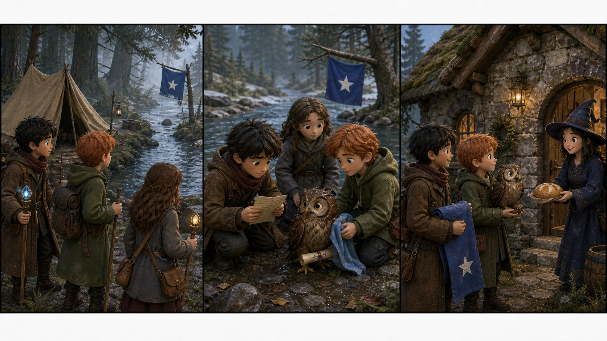

# Harry Potter and the Deathly Hallows: The Quiet River Sign

## Part 1: A Strange Sign

Harry, Ron, and Hermione are in a small tent near a cold river. They move from place to place because many dangerous wizards want to find them.

Every morning, Hermione checks the trees and the river bank. She looks for new footprints. Ron checks the food bag. Harry watches the sky for owls.

On this morning, there is no owl. There is only a blue cloth on a tree across the river. It moves in the wind. On the cloth, there is a small white star.

"That sign is new," Harry says.

Hermione looks at it carefully. "It may be a signal."

Ron puts one hand on his wand. "Or it may be a trap."

They do not cross the river at once. In these dark days, a simple sign can mean help, but it can also mean danger. Hermione makes a quiet spell around the tent. Harry's map shows a small cottage near the tree.

Then they hear a weak sound from the river bank. It is not a monster. It is a small brown owl with a wet wing.

## Part 2: The Wet Owl

The owl has a little letter on its leg. The paper is wet, but Hermione can read one line.

Please send the blue sign if the path is safe.

Ron looks at the cloth across the river. "Someone waits for this answer."

Harry gives the owl a dry cloth. Hermione checks its wing. It is not broken, but the owl cannot fly far today.

The friends need a plan. They cannot shout. They cannot make a big light. Dangerous wizards may be near.

Hermione takes three small stones from the river bank. She puts them in a line on the ground. "We can make a quiet signal," she says.

Ron finds a long branch. Harry ties the blue cloth to it. Together, they move along the river to a narrow place. The water is fast, but flat stones make a path.

Harry goes first. Ron follows with the owl in his coat. Hermione comes last and watches the trees.

Across the river, they find the cottage. A young witch opens the door. Her name is Nora. Her brother is sick, and their mother needs a safe road to the next village.

Nora sees the blue cloth and smiles. "Now Mum knows the path is safe."

## Part 3: A Quiet Road

The friends cannot stay long. They give Nora a little food and clean water. Hermione writes a short note. It says the river path is safe before sunset.

Ron gives the owl a name for the day. "I call him Puddle," he says.

The owl blinks, as if this is a good name.

Nora thanks them, but Harry shakes his head. "Keep the sign small," he says. "Small things are harder to see."

Before they go, Nora gives them a warm loaf of bread. Ron holds it like treasure.

Back at the tent, Hermione puts a new mark on the map. It is only a tiny blue star near the river, but it means something good. It means one family has a safe road.

That evening, Harry sits by the tent door. The blue cloth is gone now, but Harry does not feel alone.

Somewhere beyond the trees, a mother can find her children. A small owl can rest. And three friends can keep going.

## Useful A2 Words

- **signal**: a sign, sound, or light that gives information.
- **danger**: something that can hurt people.
- **treasure**: something very special or important.

## Reading Questions

1. What new thing do the friends see across the river?
2. Why can the owl not fly far?
3. What does Nora give the friends before they leave?

## Short Answers

1. They see a blue cloth with a small white star.
2. Its wing is wet, so it needs to rest.
3. She gives them a warm loaf of bread.
