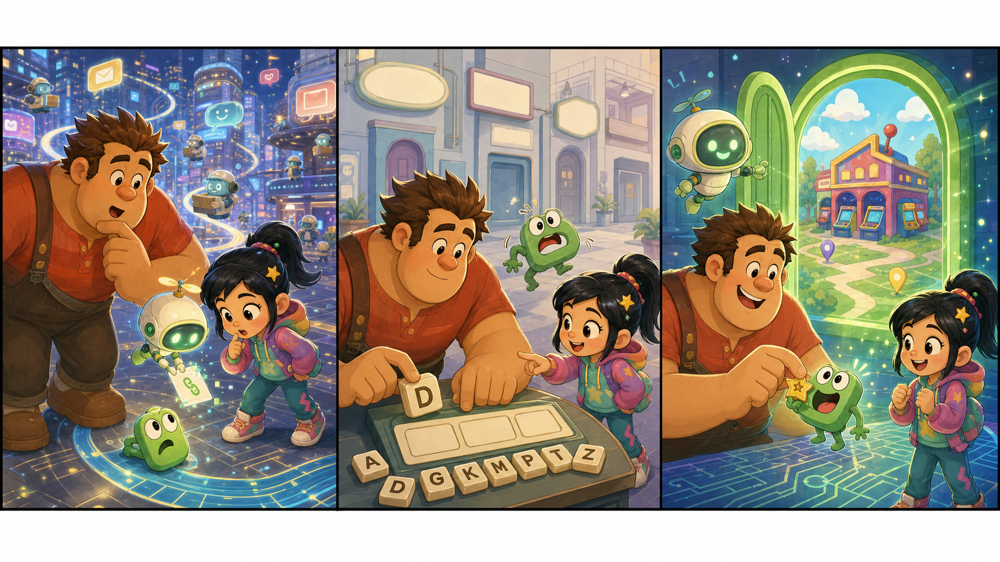

# Ralph Breaks the Internet: The Small Green Link

## Part 1: A Link With No Home

Ralph and Vanellope are in the internet again. The place is bright and busy. Small people carry messages. Big signs change every second. Fast cars of light move above the streets.

Vanellope likes this world because every road can go somewhere new. Ralph likes it less because every road can also go somewhere strange.

Today, they do not come for a game part or a funny video. Mr. Litwak needs a simple picture for the arcade website. It is a green button that says where the arcade is. The button is small, but many children use it to find the arcade.

Vanellope looks at the screen map. "The button is here, but its link has no home."

Ralph puts one large hand on the map. "A link needs a home?"

"It needs a place to go," Vanellope says. "This one goes nowhere."

A little mail bot rolls past them. It has a tiny green light on its head. The light blinks three times and then stops.

"That bot has the same color," Vanellope says.

The mail bot drops a small card. On the card there is one word: HELP.

## Part 2: The Slow Page

Ralph and Vanellope follow the mail bot to a quiet part of the internet. The streets here are not fast. Some doors open slowly. Some signs have no pictures.

At the end of the road, they find a small page with a broken green link. The link jumps up and down like a nervous frog.

"I cannot find my address," the link says.

Ralph looks worried. "Can links talk now?"

"In this place, lots of things talk," Vanellope says.

The link shows them three empty boxes. One box needs a street name. One box needs a town name. One box needs a number. The address is not dangerous, but it must be right.

Vanellope checks the arcade card in her pocket. Ralph reads the letters slowly. He is not fast with small words, but he is careful.

"Do not rush," Vanellope says. "A wrong letter can take people to the wrong place."

Ralph nods. He puts each letter into the boxes. The green link stops jumping. It becomes bright.

## Part 3: The Right Door

The page now has a new door. It is small and green. Vanellope clicks it once. A clear map opens, and the arcade sits in the middle of it.

The mail bot makes a happy sound. Its green light comes on again.

"So the button works?" Ralph asks.

"Yes," Vanellope says. "Now people can find the arcade."

Ralph smiles. "Good. I like doors that go to real places."

Before they leave, the green link gives Ralph a little star sticker. It is not magic. It is only a thank-you sticker, but Ralph puts it on his shirt.

Back in the arcade, Mr. Litwak opens the website. The green button is there. A child points to the screen and says, "Look, now we can find the arcade on the map."

Vanellope grins at Ralph. Ralph tries to look proud, but he also looks shy.

The internet is still big and noisy. It still has many strange roads. But today Ralph learns one simple thing: even a small link can help someone get home.

## Useful A2 Words

- **link**: something on a screen that takes you to another place.
- **address**: the place where someone or something is.
- **nervous**: worried or not calm.

## Reading Questions

1. What does Mr. Litwak need for the arcade website?
2. What information does the green link need?
3. What does the green link give Ralph?

## Short Answers

1. He needs a green button with the arcade location.
2. It needs the street name, town name, and number.
3. It gives Ralph a little star sticker.
