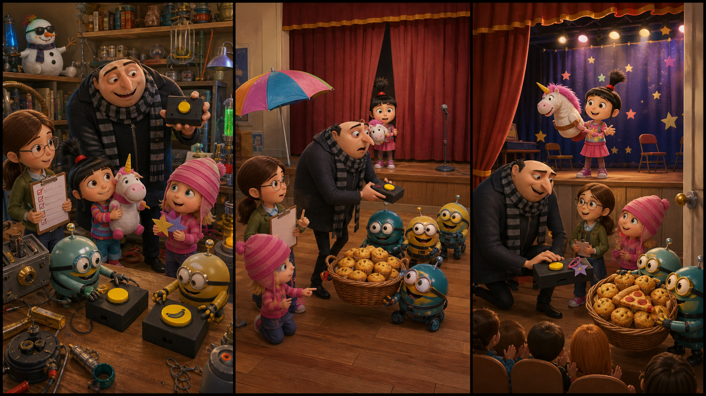

# Despicable Me: The Banana Button Mix-Up

*Picture Hunt: Can you find one funny mistake in each panel?*

## Part 1: A Button for the Show

Gru wants one quiet morning. This is not easy in his house. The girls are getting ready for a school show, and the Minions are in the lab.

Agnes has a small unicorn puppet. Margo has a list. Edith has a box of paper stars.

"We need a curtain for the show," Margo says. "It must open at the right time."

Gru smiles. "I can make that. It is simple."

In the lab, Gru builds a little black box with one yellow button. When someone presses the button, a curtain can open. Agnes claps her hands.

"It is perfect!" she says.

The Minions watch from a table. They also have a yellow button. Their button is for a banana snack alarm. It rings when the bananas are ready.

One Minion puts both buttons on the same table. Another Minion puts a banana sticker on one button. Then the phone rings. Gru turns around for one second.

When he looks back, the two yellow buttons are mixed up.

Gru takes one button and puts it in his pocket.

"Come on, girls," he says. "We must go to school."

Behind him, the Minions hear a loud sound from the lab.

"Banana?" one Minion says.

## Part 2: A Strange Sound

At school, the hall is full of children and parents. Agnes stands behind the curtain with her puppet. Margo checks the list again. Edith throws one paper star into the air.

Gru holds the yellow button. "Do not worry. I have everything under control."

Margo looks at him. "Are you sure?"

"Very sure," Gru says.

The teacher calls Agnes's name. Gru presses the button.

But the curtain does not open.

Instead, Gru's phone makes a loud banana song. At the same time, three Minions run into the hall with a basket of hot banana cakes.

The children laugh. Agnes looks worried, but she does not cry.

"This is the wrong button," Margo says.

Gru's face goes red. "Yes. Maybe a little wrong."

Edith points to one Minion. "Look at his bag!"

Inside the bag is the other yellow button. It has a small piece of black tape on it. Gru remembers his curtain box.

"That is our button," he says.

The Minion gives it to Agnes with a shy smile.

## Part 3: The Curtain Opens

Gru kneels next to Agnes. "I am sorry. Your show is important."

Agnes gives him a hug. "It is okay. The banana cakes smell nice."

Gru checks the right button. The tape is loose, but the button still works. He asks Margo for one hair clip and Edith for one paper star. He fixes the button carefully.

The teacher waits. The room is quiet.

Agnes stands behind the curtain again. Gru presses the button.

This time, the curtain opens slowly. Agnes lifts her unicorn puppet and tells a short story about a lost star. Her voice is small, but everyone listens.

When the story ends, the room is full of clapping.

The Minions stand by the door. They hold the banana cakes like a prize. Gru looks at them and shakes his head, but he is smiling.

"Next time," he says, "we use labels."

Margo writes that on her list. Edith sticks a paper star on the correct button. Agnes gives one banana cake to Gru.

Gru takes a bite. It is warm and sweet. A mixed-up button can make trouble, but a family can fix it together.

## Useful A2 Words

- **curtain**: a large piece of cloth that can open or close a stage.
- **control**: the power to make something work in the right way.
- **label**: a small note that tells what something is.

## Reading Questions

1. What does Gru build for the school show?
2. What happens when Gru presses the wrong button?
3. What does Gru say they should use next time?

## Short Answers

1. He builds a button that opens the curtain.
2. His phone plays a banana song, and the Minions bring banana cakes.
3. He says they should use labels.
