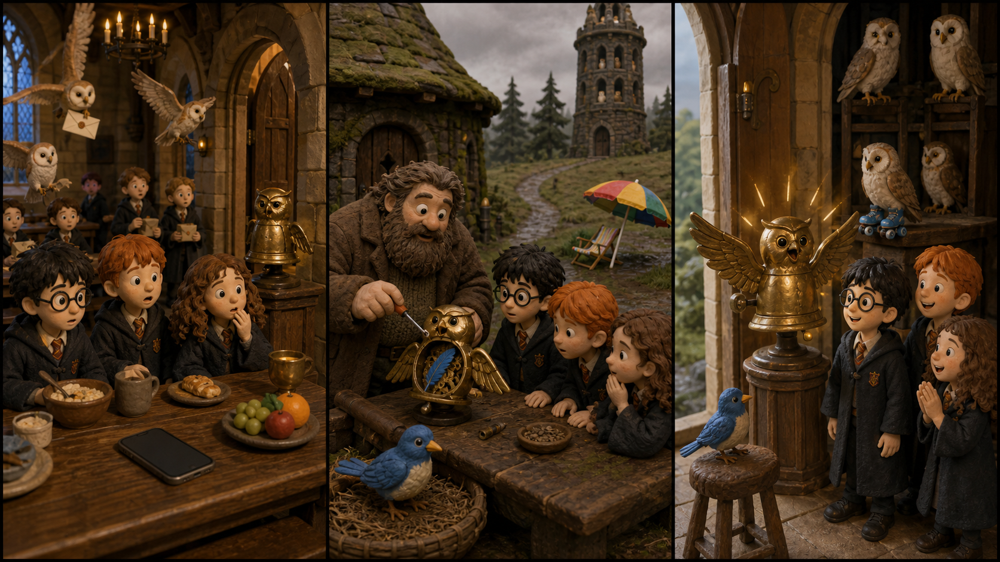

# Harry Potter and the Sorcerer's Stone: The Lost Owl Bell

*Picture Hunt: Can you find one funny mistake in each panel?*

## Part 1: A Very Quiet Morning

Harry is in his first year at Hogwarts. Every morning, owls come into the Great Hall with letters and small parcels. There is also a little brass bell near the door. It looks like an owl. When the post is ready, the bell gives one clear ring.

But today the bell is quiet.

Harry sits with Ron and Hermione at breakfast. Many owls fly above the tables, but the small bell does not make a sound.

"That is strange," Hermione says. "The owl bell always rings."

Ron looks at a group of new students near the door. They are holding letters and looking worried.

"Maybe they do not know where to take their post," he says.

Harry walks to the bell. It is cold. Its little metal wings do not move.

Professor McGonagall sees them by the door. She is busy, but her voice is calm.

"Please take the bell to Hagrid," she says. "He knows many things about school owls. Be careful. It is old."

Harry puts the bell in a cloth bag. The bag is small, but the bell feels heavy.

## Part 2: The Blue Feather

Harry, Ron, and Hermione go across the school grounds. The sky is grey, and the grass is wet. Hagrid is outside his hut with a basket of owl food.

"A quiet owl bell?" Hagrid says. "That's not good. Owls like a proper sign."

He opens the back of the bell with a tiny tool. Inside, there is a blue feather. It is stuck between two small wheels.

Hermione looks at it closely. "This feather is not from an owl in the Great Hall."

"How do you know?" Ron asks.

"It is too blue," she says. "Most school owls have brown, white, or grey feathers."

Hagrid thinks for a moment. Then he points up to the old owlery.

"A small storm came last night," he says. "Maybe a lost bird came in there."

The three friends climb the cold steps to the owlery. At the top, they find a little blue bird beside a window. It is not hurt, but it is tired.

Harry speaks softly. "You are safe now."

The bird gives one small sound, like a thank-you.

## Part 3: The Ring Again

Hagrid gives the bird warm water and a quiet place to rest. Hermione takes the blue feather out of the bell. Ron turns the small wheels, and Harry holds the bell steady.

At last, the metal owl opens its wings.

Ring!

The sound is bright and clear. Owls in the tower turn their heads. Ron smiles.

"Good," he says. "Now everyone can find their letters."

They bring the bell back to the Great Hall before lunch. Professor McGonagall puts it near the door again. The new students come with their post, and this time the bell rings for them.

Harry watches one small boy find his parcel and smile.

"It is only a little bell," Harry says.

Hermione shakes her head. "Little things can help a lot."

Ron looks at the bell and grins. "And little feathers can make a big problem."

Harry laughs. Hogwarts is full of magic, but today the answer is simple. A kind voice, careful hands, and one lost feather make the morning right again.

## Useful A2 Words

- **parcel**: a thing wrapped in paper and sent to someone.
- **proper**: right or correct.
- **steady**: not moving or shaking.

## Reading Questions

1. What does the brass owl bell do every morning?
2. What is inside the bell?
3. Where do Harry, Ron, and Hermione find the tired bird?

## Short Answers

1. It rings when the post is ready.
2. There is a blue feather inside it.
3. They find it in the old owlery.
