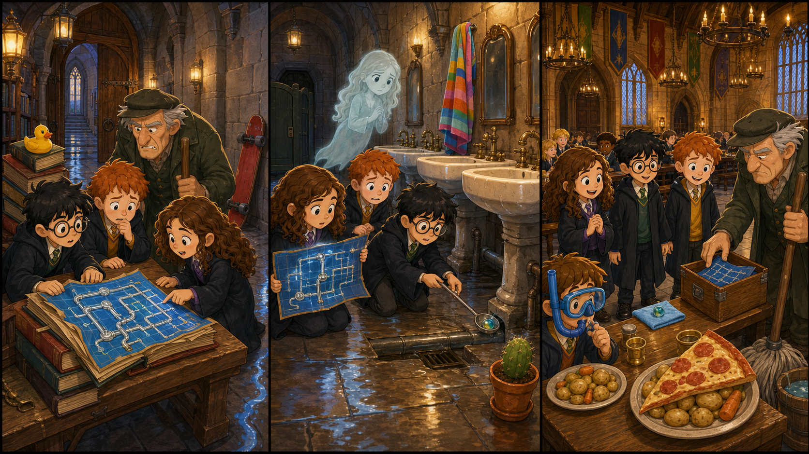

# Harry Potter and the Chamber of Secrets: The Whispering Pipe Map

*Picture Hunt: Can you find two funny mistakes in each panel?*

## Part 1: Water in the Hall

Harry is in his second year at Hogwarts. The school feels quiet in a strange way. Many students talk softly in the halls.

One wet morning, Harry, Ron, and Hermione walk to Charms. Near the library door, they see a line of water on the stone floor.

"That was not here yesterday," Hermione says.

Ron steps back. "I do not like water in old castles."

Harry hears a small sound from the wall. It is not a voice. It is a tap, tap, tap, like a tiny finger on a pipe.

Filch comes around the corner with a mop. His face is red.

"The old pipe map is gone," he says. "I cannot find the leak without it."

Hermione looks at the wet floor. "A map of the school pipes?"

"Yes," Filch says. "It is very old. It shows which pipes are awake and which pipes are sleeping."

Ron opens his eyes wide. "Pipes sleep?"

Harry listens again. Tap, tap, tap.

"Maybe the map is near the sound," he says.

The three friends follow the water line to a small reading table near the library. Under a pile of books, they find a thin blue map. Little silver lines move across it.

## Part 2: The Blue Line

Hermione opens the pipe map carefully. A blue line runs from the library wall to an empty bathroom on the second floor.

"This line is bright," she says. "It must be the problem."

Ron looks at the map. "Why does it go past that bathroom?"

Harry feels cold for a moment. He knows that bathroom. Moaning Myrtle often stays there.

They walk down the corridor. The water line is small, but it is easy to follow. At the bathroom door, Myrtle sits above a sink and looks unhappy.

"Everyone blames me for water," she says.

"We are not blaming you," Harry says. "We are looking for a leak."

The pipe map gives a soft blue light. It points to a pipe under the last sink.

Hermione kneels and looks closely. "Something is stuck inside."

Ron gives Harry a long spoon from his bag. "Do not ask why I have this."

Harry uses the spoon carefully. He pulls out a small glass marble. It shines blue and green.

Myrtle stops crying. "That is mine. I lost it last week."

## Part 3: A Quiet Pipe

Hermione dries the marble with her sleeve and gives it to Myrtle. Myrtle smiles a little.

The pipe map changes at once. The bright blue line becomes silver. The tap, tap, tap sound stops.

"So the marble was stopping the water," Ron says.

"It was stopping one small pipe," Hermione says. "Then the water had nowhere to go."

Harry puts the pipe map back into its cloth cover. The map feels warm now, like it is happy.

They take it to Filch. He looks at the clean floor and then at the old map.

"You found it," he says. His voice is still sharp, but not as sharp as before.

"It was under some library books," Harry says.

Filch takes the map and puts it in a wooden box near his mop.

At lunch, the Great Hall is dry. The students talk a little louder. Ron puts extra potatoes on his plate.

"Today we save the school from a marble," he says.

Hermione smiles. "Small things can make big problems."

Harry looks at the quiet wall. Hogwarts is still full of secrets, but some secrets are only pipes, maps, and a lost blue marble.

## Useful A2 Words

- **pipe**: a long tube that carries water.
- **leak**: a place where water comes out by mistake.
- **marble**: a small round glass ball.

## Reading Questions

1. What is on the stone floor near the library door?
2. Where does the bright blue line on the map go?
3. What is stuck inside the pipe?

## Short Answers

1. There is a line of water on the floor.
2. It goes to an empty bathroom on the second floor.
3. A small glass marble is stuck inside the pipe.
