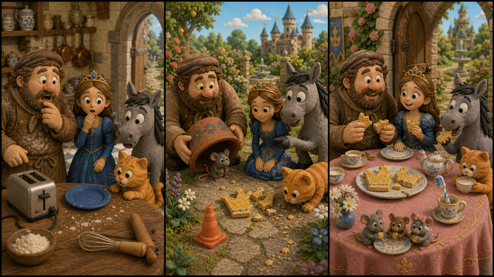

# Shrek 2: The Lost Crown Cookie

*Picture Hunt: Can you find one funny mistake in each panel?*

## Part 1: A Small Royal Problem

Shrek and Fiona are visiting Far Far Away. The castle is big, bright, and very clean. Shrek likes the swamp better, but he tries to be polite.

One afternoon, the Queen asks for help in the royal kitchen.

"Tonight we have a small tea party," she says. "There is one special cookie for the table. It is shaped like a crown."

Donkey looks at the cookie tray. "A crown cookie? That sounds fancy and tasty."

Puss in Boots jumps onto a chair. "I can guard it," he says.

Shrek folds his arms. "We only need to keep one cookie safe?"

"Yes," Fiona says. "That sounds easy."

But nothing is easy when Donkey is hungry.

The cook puts the crown cookie on a blue plate. It has gold sugar on top and five little points. Then the cook leaves to get more tea cups.

For one minute, everyone looks at the door.

When they look back, the blue plate is empty.

Donkey gasps. "I did not eat it!"

Shrek looks at him. "You say that very fast."

Fiona sees small sugar marks on the floor. They go out of the kitchen and into the garden.

"Then we follow the sugar," she says.

## Part 2: Sugar in the Garden

The garden behind the castle is full of flowers and little stone paths. The sugar marks shine in the sun.

Donkey walks slowly. "Maybe the cookie ran away."

"Cookies do not run," Shrek says.

Puss looks at the ground. "But small feet can carry them."

Near a rose bush, Fiona finds a tiny piece of gold sugar. Beside it, there is a green ribbon.

"This ribbon is from the kitchen basket," she says.

They hear a soft crunch behind a flower pot.

Shrek lifts the pot. Under it sits a small mouse. The mouse has the crown cookie beside him, but he has not eaten much. He looks scared.

Donkey points. "A royal cookie thief!"

The mouse covers his face with his paws.

Fiona kneels down. "It is okay. Why did you take it?"

The mouse points to a tiny house in the garden wall. Inside, three baby mice are sleeping. There is no food near them.

Shrek sighs. "So he is not a thief. He is a dad."

## Part 3: A Better Tea Party

Fiona picks up the cookie. It is broken at one side, but it still looks like a crown.

"We can share it," she says.

Shrek brings small pieces of bread from the kitchen. Donkey carries a little bowl of berries. Puss walks very slowly with a cup of milk.

The mouse family comes out of the wall. The baby mice eat the bread and berries. The father mouse gives the crown cookie back to Fiona.

At the tea party, the Queen sees the broken cookie.

"What happened?" she asks.

Shrek looks at Donkey. Donkey shakes his head.

Fiona smiles. "We found someone who needed dinner more than we needed a perfect cookie."

The Queen nods. "Then it is still a royal cookie."

The cook breaks it into small pieces. Everyone gets one bite. Even the mouse family has a tiny plate near the garden door.

Donkey eats his piece and smiles. "Best crown I ever tasted."

Shrek laughs. Far Far Away is too clean and too fancy, but today it feels a little warmer. Sometimes a broken cookie makes a better party.

## Useful A2 Words

- **royal**: about a king, queen, or palace.
- **guard**: to keep something safe.
- **share**: to give part of something to others.

## Reading Questions

1. What shape is the special cookie?
2. Where do Shrek, Fiona, Donkey, and Puss find the cookie?
3. Why does Fiona say they can share the cookie?

## Short Answers

1. It is shaped like a crown.
2. They find it in the garden, near a flower pot.
3. Because the mouse family needs food.
