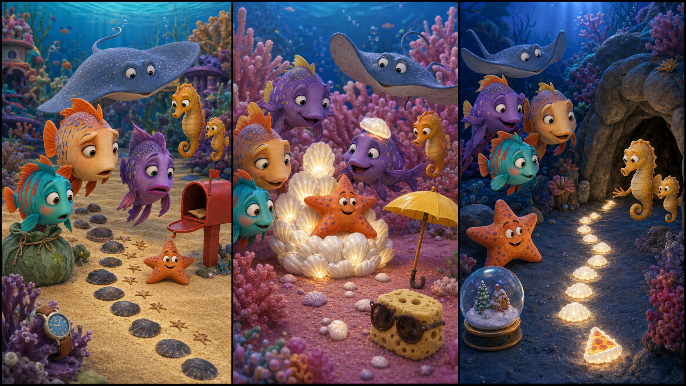

# Finding Nemo: The Glowing Shell Trail

*Picture Hunt: Can you find two funny mistakes in each panel?*

## Part 1: A Dark Reef Path

Nemo is swimming near the reef school with his friends. The water is clear, and little fish move between the coral. Marlin watches from close by, because he likes to know where Nemo is.

Dory swims in a happy circle. "This is a very nice day," she says. "I think I remember that."

Then a small seahorse comes to the class. Her name is Lila. She looks worried.

"My little brother cannot find the quiet cave," Lila says. "The shell trail is dark."

Nemo knows the trail. It is a line of small white shells on the sand. At night, the shells shine a little, so young fish can find the cave.

Marlin looks at the deep blue water beyond the reef. "Maybe an adult should help."

"We can help together," Nemo says. "We do not have to go far."

Mr. Ray asks everyone to stay calm. He gives Nemo, Marlin, and Dory a small seaweed bag.

"If you find the missing shells, put them back on the trail," he says.

Dory looks inside the bag. "Good. A bag for shells. Or snacks. But mostly shells."

They swim to the start of the trail. Three shells are still shining, but after that the sand is empty.

Nemo sees tiny marks in the sand. They look like little star shapes.

"Something carried the shells away," he says.

## Part 2: The Star Marks

Nemo follows the star marks slowly. Marlin stays close. Dory tries to count the marks, but she starts at seven and then forgets why.

The marks lead to a garden of soft pink coral. Behind the coral, they find a young starfish. He is sitting on a pile of glowing shells.

"Hello," Dory says. "You have a very shiny chair."

The starfish jumps. "Oh! Are these yours?"

"They are for the trail," Nemo says. "A little seahorse needs them to find the cave."

The starfish looks down. "I am sorry. I thought they were lost. I wanted to make my home bright."

Marlin feels less angry when he hears that. "You should ask before you take things."

The starfish nods. "I can help put them back."

Together, they put the shells into the seaweed bag. One shell is under a leaf. Another shell is stuck beside a small crab hole.

Dory finds the last shell on her head.

"Look," she says. "I am useful and shiny."

Nemo laughs. The starfish laughs too. Even Marlin smiles a little.

They all carry the shells back to the sandy path.

## Part 3: The Safe Cave

The water is getting darker now. Nemo puts the first shell on the sand. The starfish puts the second shell next to it. Marlin checks the spaces, and Dory sings a soft song so no one feels scared.

Soon the trail shines again. It is not bright like the sun, but it is bright enough.

Lila comes with her little brother. He looks at the shells and smiles.

"Now I can see the way," he says.

The small seahorse swims along the trail to the quiet cave. Lila follows him. At the cave door, they turn and wave.

The starfish sits beside the first shell. "I can watch the trail tonight," he says.

Marlin nods. "That is a good idea."

Nemo feels proud. The reef is big, and sometimes the dark water feels strange. But small lights can help a lot.

Dory looks at the shining path. "I love this trail," she says. "It helps fish remember where to go."

Marlin looks at her. "Does it help you?"

Dory thinks for a moment. "Maybe. What were we talking about?"

Everyone laughs, and the shells shine softly in the blue water.

## Useful A2 Words

- **trail**: a path that shows where to go.
- **calm**: not worried or angry.
- **carry**: to take something from one place to another.

## Reading Questions

1. Why is Lila worried?
2. Who has the glowing shells?
3. What does the starfish do at the end?

## Short Answers

1. Her little brother cannot find the quiet cave.
2. A young starfish has the glowing shells.
3. He watches the trail for the night.
