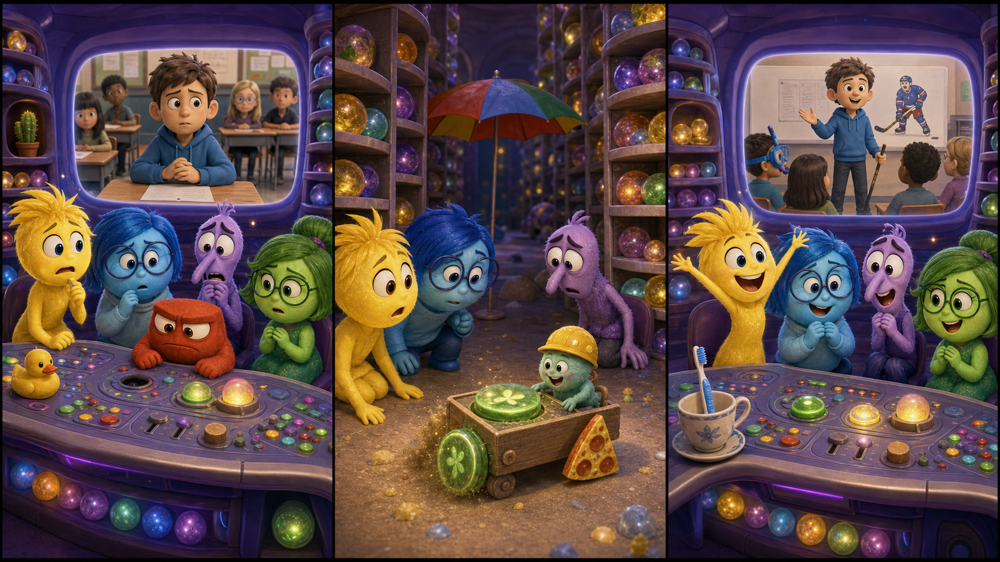

# Inside Out: The Calm Button

*Picture Hunt: Can you find two funny mistakes in each panel?*

## Part 1: A Big School Talk

Riley has a short talk at school today. She must stand in front of the class and tell everyone about her favorite hockey memory.

Inside Riley's mind, Joy is ready. She has a bright yellow card that says the first idea. Sadness sits near the memory shelves and holds a blue pencil. Fear checks the clock again and again.

"We have three minutes," Fear says. "Three very long minutes."

Anger looks at the control desk. "Where is the calm button?"

Joy turns around. "It is always next to the confidence light."

But the little green calm button is not there.

Disgust looks under the desk. "This floor is very dusty. That is not a feeling. That is a problem."

Riley is sitting at her school desk. Her teacher smiles and says, "You are next, Riley."

In headquarters, the lights shake a little.

Fear puts his hands on his face. "No calm button? This is not calm at all."

Joy takes a deep breath. "We can find it. Riley knows this memory. She just needs a soft start."

Sadness points to the memory shelves. A small green light is moving behind them.

"Maybe the button rolled away," she says.

Joy runs to the shelves. "Then we follow the light."

## Part 2: Behind the Shelves

The green light moves behind a tall shelf of hockey memories. Joy, Sadness, and Fear squeeze through a narrow space. Anger waits by the controls, ready to stop any loud thought.

Behind the shelf, they find a tiny memory worker. He is using the calm button as a wheel for a little cart.

Joy blinks. "Excuse me. That is important."

The worker looks surprised. "Oh! I thought it was a spare part."

Fear points to the school screen. Riley is walking to the front of the class. Her hands are moving a lot.

"We need it now," Fear says.

Sadness sits beside the worker. "It is okay. Mistakes happen."

The worker gives back the button. But it is sticky with memory dust and does not press down.

Disgust calls from the control desk. "Please clean that before it touches anything."

Joy wipes the button with the yellow card. Sadness blows gently on it. Fear counts to five, very fast.

Click.

The button works again.

## Part 3: One Calm Start

Joy carries the calm button back to the desk. Anger makes room for it beside the confidence light.

On the school screen, Riley stands in front of her class. She looks at the floor first. Then she looks at one friend near the window.

Joy presses the calm button.

Riley takes one slow breath.

"My favorite hockey memory is from a cold Saturday," Riley begins.

The words come slowly at first. Then they become easier. Riley talks about the ice, her team, and the sound of skates. Her classmates listen.

Fear still watches the clock, but he is quieter now. Sadness smiles a little when Riley says she missed her old team. Joy lets that feeling stay.

"Good talk," the teacher says when Riley is done.

Inside headquarters, everyone cheers.

Anger points at the button. "Next time, no one uses this as a wheel."

The little worker nods. "I will use a real wheel."

Joy puts a small label next to the button. Riley does not need to feel happy all the time. Sometimes she just needs one calm start.

## Useful A2 Words

- **calm**: quiet and not worried.
- **confidence**: the feeling that you can do something.
- **memory**: something you remember.

## Reading Questions

1. What must Riley do at school?
2. Who is using the calm button as a wheel?
3. What does Riley do after Joy presses the calm button?

## Short Answers

1. She must give a short talk about a hockey memory.
2. A tiny memory worker is using it.
3. She takes one slow breath and starts her talk.
