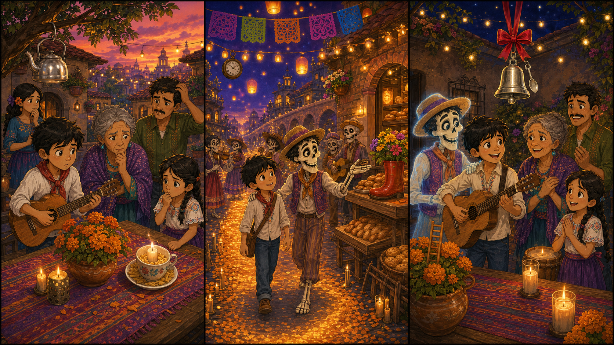

# The Silver Bell Song

## Part 1: The Missing Bell

Miguel sits in the family courtyard with his small guitar. Tonight is family music night. Abuelita puts candles on the table, and Tia Rosa brings sweet bread. Everyone is busy, but everyone is happy.

Then Mama Imelda looks at the table and stops.

"Where is the silver bell?" she asks.

The bell is small, but it is important. The family rings it before the first song. It tells everyone, "Listen with your heart."

Miguel looks under the flowers. He looks beside the candles. He looks near the guitar case.

"I can find it," he says.

"Do not run," Abuelita says. "Use your eyes, and use your ears."

Miguel tries to be calm. He hears shoes in the street, plates in the kitchen, and a dog barking far away. Then he hears one tiny sound.

Ting.

It is very soft. It comes from near the old photo table.

Miguel takes one slow breath. The sound comes again.

Ting.

It is not in the courtyard. It is somewhere beyond the bright flowers.

## Part 2: A Sound Across the Bridge

Miguel follows the sound to the glowing bridge. The orange flowers shine under his feet. On the other side, the streets are bright with lights and paper flags.

A kind skeleton friend waves to him. His name is Hector. He carries an old hat and smiles with warm eyes.

"You look worried, muchacho," Hector says.

"The family bell is lost," Miguel says. "Music night cannot start without it."

Hector listens. "A lost thing often makes a small noise. We must be patient."

They walk past music stands, lanterns, and happy families. A trumpet plays near a door. A baker sings while he puts bread in a basket. Miguel hears many sounds, but he waits for the smallest one.

Ting.

He stops near the bakery stall.

"There!" he says.

The baker opens a cloth bag. Inside are ribbons, paper stars, and the silver bell. It is tied to a yellow ribbon.

"I am sorry," the baker says. "I used this bag for the party. I did not see the bell."

Miguel smiles. "It is all right. The bell wanted a little adventure."

Hector laughs. "Then let us take it home before it joins a band."

## Part 3: Listening First

Back in the courtyard, Miguel gives the silver bell to Mama Imelda. She touches the ribbon and smiles.

"You found it because you listened," she says.

Abuelita nods. "Fast feet are useful. Quiet ears are useful too."

Miguel hangs the bell above the music table. Everyone becomes still. He gently rings it.

Ting.

The sound is clear and sweet. It is small, but everyone hears it.

Miguel plays the first notes on his guitar. His family joins him. The song is not loud at first. It begins like the bell, soft and careful. Then it grows warm and bright.

Miguel looks at the photo table. For a moment, he sees Hector smiling in the candlelight, like a happy memory.

Miguel smiles back. He understands something new. Music is not only about playing. It is also about listening before the song begins.

That night, the family sings for a long time. The little silver bell shines above them, and Miguel remembers its lesson.

## Picture Hunt

There are two funny mistakes in each picture panel. Can you find all six?

## Useful A2 Words

- **important**: something that matters a lot.
- **patient**: able to wait calmly.
- **memory**: something you remember from the past.

## Reading Questions

1. What is missing from the family table?
2. Where does Miguel find the silver bell?
3. What does Miguel learn before music night begins?

## Short Answers

1. The silver bell is missing.
2. He finds it in a cloth bag near the bakery stall.
3. He learns that listening is important before playing music.
