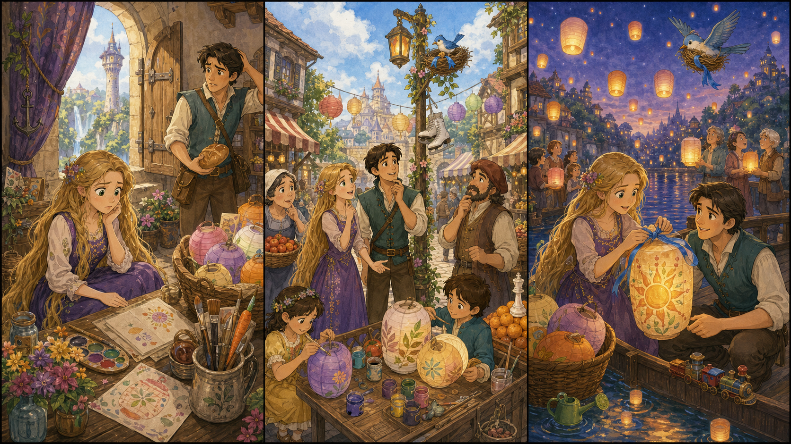

# The Blue Ribbon Lantern

## Part 1: The Empty Basket

Rapunzel sits near the tower window with her paints. Morning light comes into the room. On the floor, there are flowers, brushes, and a basket of paper lanterns.

Today is the village lantern walk. The first lantern needs a blue ribbon. The ribbon keeps it closed until the children stand by the river.

Rapunzel looks in the basket. She sees yellow ribbon, green ribbon, and red ribbon.

But the blue ribbon is gone.

"Oh no," she says. "This is the safest ribbon. It is soft, but it is strong."

Eugene comes to the door with a bag of bread.

"Is there a problem?" he asks.

"The blue ribbon is missing," Rapunzel says. "The children are waiting for the first lantern."

Eugene smiles kindly. "Then we find it before sunset."

Rapunzel wants to run at once, but she stops. She looks carefully around the room. On the table, she sees one small blue thread.

"This came from the ribbon," she says.

The thread points toward the open window. Rapunzel takes her lantern basket, and they hurry down to the village.

## Part 2: The Helpful Market

The village is busy. Bakers carry warm bread. Children paint stars on paper lanterns. An old man fixes a wooden boat near the square.

Rapunzel shows the blue thread to a lantern maker.

"Did you see a ribbon like this?" she asks.

The lantern maker thinks. "A little bird took something blue this morning. It flew near the fruit stall."

Rapunzel thanks him. She and Eugene walk to the fruit stall. There are oranges, apples, and pears in neat piles.

A girl points to the bread basket. "I saw blue there!"

Rapunzel looks inside. There is only a blue flower.

Eugene laughs softly. "Wrong blue."

Rapunzel does not feel angry. Everyone is trying to help. That makes the search easier.

Then she hears a small flap above them. A bird sits on the lantern pole. In its nest is the blue ribbon.

"It is using the ribbon for a bed," Rapunzel says.

Eugene holds up a piece of soft cloth. The bird looks at it. Rapunzel waits quietly. Soon the bird takes the cloth and drops the ribbon.

## Part 3: The First Light

At twilight, the children stand by the river. Rapunzel ties the blue ribbon around the first lantern. She checks it once. Then she checks it again.

"Safe?" Eugene asks.

"Safe," Rapunzel says.

The smallest child holds the lantern with both hands. Rapunzel helps her lift it. The lantern rises slowly. The blue ribbon opens, and warm light fills the air.

One by one, more lanterns float above the river. Their lights shine on the water like tiny stars.

The children cheer. The lantern maker claps. The bird flies over the dock with the soft cloth in its nest.

Rapunzel smiles. "We found the ribbon because many people helped."

Eugene nods. "And because you looked carefully."

Rapunzel watches the first lantern move into the sky. It is not the biggest light, but it starts the walk. Sometimes one small ribbon can help a whole village begin.

## Picture Hunt

There are two funny mistakes in each picture panel. Can you find all six?

## Useful A2 Words

- **ribbon**: a long, thin piece of cloth used for tying things.
- **carefully**: with a lot of attention.
- **village**: a small town.

## Reading Questions

1. What is missing from the lantern basket?
2. Where does Rapunzel find the blue ribbon?
3. Why does the first lantern matter?

## Short Answers

1. The blue ribbon is missing.
2. She finds it in a bird's nest on the lantern pole.
3. It starts the village lantern walk.
