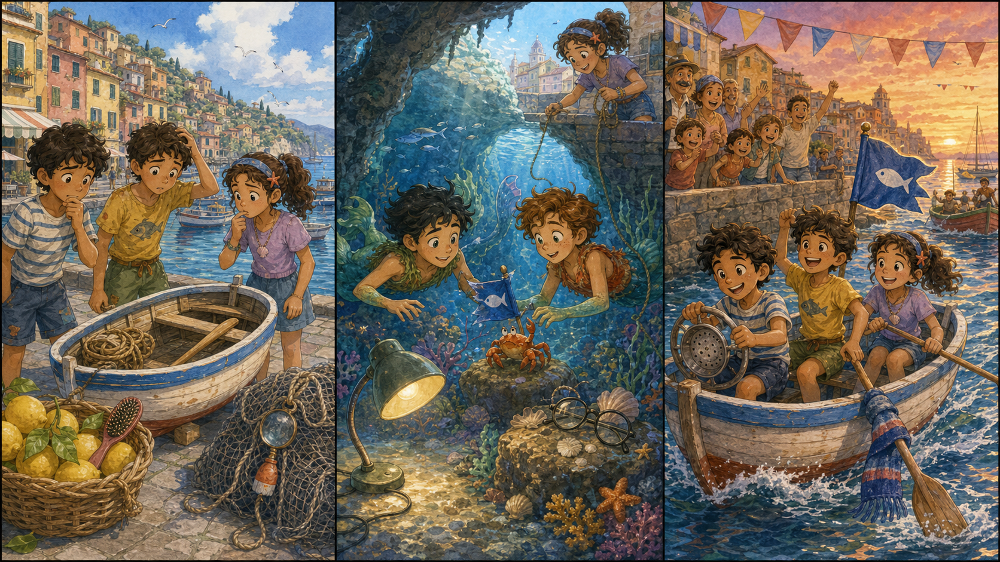

# The Blue Harbor Flag

## Part 1: The Small Race

Luca stands by the harbor with Alberto and Giulia. The morning sun is warm, and the water is bright. Today the village has a small boat race for children.

Giulia checks the little wooden boat. There is a rope, two oars, and a lunch bag.

"Where is the blue flag?" she asks.

Luca looks at the mast. The flag is not there. It is important because it shows that their boat is ready and safe.

Alberto looks under the seat. "No flag."

Giulia looks in the lunch bag. "Only bread."

Luca feels worried, but he tries to think. He sees a tiny blue thread on the dock. It is caught on an old fishing net.

"This thread is from the flag," Luca says.

The thread goes from the net into the water. Luca smiles a little. He knows the harbor well, but the water can still hide surprises.

"We have time," Giulia says. "Look carefully."

Luca and Alberto nod. Then they jump into the sea.

## Part 2: The Grotto Clue

Under the water, Luca and Alberto swim through soft green plants. Small fish move past them like silver lights. The blue thread waves near a group of rocks.

"It goes to the grotto," Alberto says.

The grotto is quiet and cool. Sunlight comes through a small hole above. Luca sees shells, smooth stones, and one tiny crab house.

Then he sees the blue flag.

It is not broken. It is wrapped around a little rock near the crab house. A crab pushes it with one claw.

"Maybe it likes the color," Luca says.

Alberto laughs. "Or maybe it wants to join the race."

Luca moves slowly. He does not want to scare the crab. He puts a shiny shell beside the rock. The crab looks at the shell. Then it lets go of the flag.

Luca takes the flag gently. "Thank you," he says.

The two friends swim back to the dock as fast as they can.

## Part 3: Ready to Go

Giulia is waiting with the boat. The other children are already near the start line.

"Did you find it?" she asks.

Luca holds up the blue flag. It is wet, but it is safe.

Giulia ties it to the mast. Alberto checks the rope. Luca dries the seat with a cloth. The village bell rings once.

"Ready?" Giulia asks.

"Ready!" Luca and Alberto say.

Their boat moves slowly at first. Then the wind catches the blue flag, and the little boat goes forward.

People cheer from the dock. Luca looks at the flag and smiles. It is only a small piece of cloth, but it helps everyone know the boat is ready.

After the race, Giulia puts the flag in a dry box.

"Tomorrow," Alberto says, "we check the flag first."

Luca laughs. "And we check the crab house too."

## Picture Hunt

There are two funny mistakes in each picture panel. Can you find all six?

## Useful A2 Words

- **harbor**: a safe place by the sea for boats.
- **grotto**: a small cave, often near water.
- **gently**: in a soft and careful way.

## Reading Questions

1. What is missing from the little boat?
2. Where do Luca and Alberto find the flag?
3. What does the blue flag show?

## Short Answers

1. The blue flag is missing.
2. They find it near a crab house in the grotto.
3. It shows that the boat is ready and safe.
