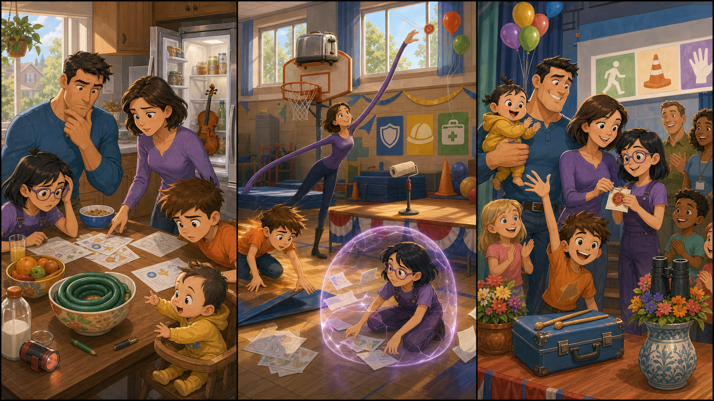

# The Red Helper Badge

## Part 1: Before School

Dash runs into the kitchen with one shoe in his hand. Violet is already at the table. Bob makes breakfast, and Helen puts papers into a school bag.

Today is school safety day. The family will help, but they must look like a normal family. No big suits. No big show.

Dash needs a small red helper badge. The badge tells the teacher that he can help younger children find their seats.

"Where is my badge?" Dash asks.

Violet looks under a cereal bowl. Bob checks beside the fruit. Helen looks near the door.

Jack-Jack sits in his chair and laughs. He points at the school papers.

"Not funny," Dash says, but he smiles a little.

Violet sees a red mark on one paper. "The badge was here."

Helen nods. "Then it may be in the gym already. We packed the safety posters last night."

Dash wants to run to school, but Helen touches his shoulder.

"Fast is good," she says. "Careful is better."

## Part 2: The Windy Gym

At school, the gym is full of mats, balloons, and picture posters. Children carry chairs. A teacher waves to Helen.

"The safety day starts soon," the teacher says.

Dash looks near the stage. Violet checks behind the mats. Bob lifts a heavy box with one hand, but he does it quietly so no one notices.

Then a window opens with a bang. Wind blows across the gym. Papers fly into the air.

Violet makes a soft shield. The papers stop in front of her like birds against glass.

"Good catch," Bob says.

Helen stretches one arm to close the window. She sees something red near a balloon string.

"Dash, look up," she says.

Dash stops. He does not race. He looks carefully. The red badge is stuck to the balloon string above the stage.

He grins. "I found it!"

## Part 3: A Quiet Team

Helen gently pulls the balloon string down. Dash takes the red helper badge and pins it to his card.

"Thank you," he says.

The teacher claps once. "Now we can begin."

Bob holds Jack-Jack, who tries to grab the balloons. Violet smiles because the papers are safe. Dash stands by the front row and helps two small children find their seats.

No one sees a big superhero fight. No one sees a loud rescue. They only see a family helping at school.

Dash looks at the badge. It is small, but it matters.

"I did not run," he says to Violet.

"I noticed," Violet says. "That was new."

Dash laughs. The gym doors open, and safety day begins. He learns that being a hero can mean moving slowly, listening well, and helping one person at a time.

## Picture Hunt

There are two funny mistakes in each picture panel. Can you find all six?

## Useful A2 Words

- **badge**: a small sign that shows your job or team.
- **careful**: doing something with attention.
- **shield**: something that protects people or things.

## Reading Questions

1. What does Dash need for school safety day?
2. Where is the red badge found?
3. What does Dash learn about being a hero?

## Short Answers

1. He needs a small red helper badge.
2. It is stuck to a balloon string above the stage.
3. He learns that heroes can help slowly and carefully.
