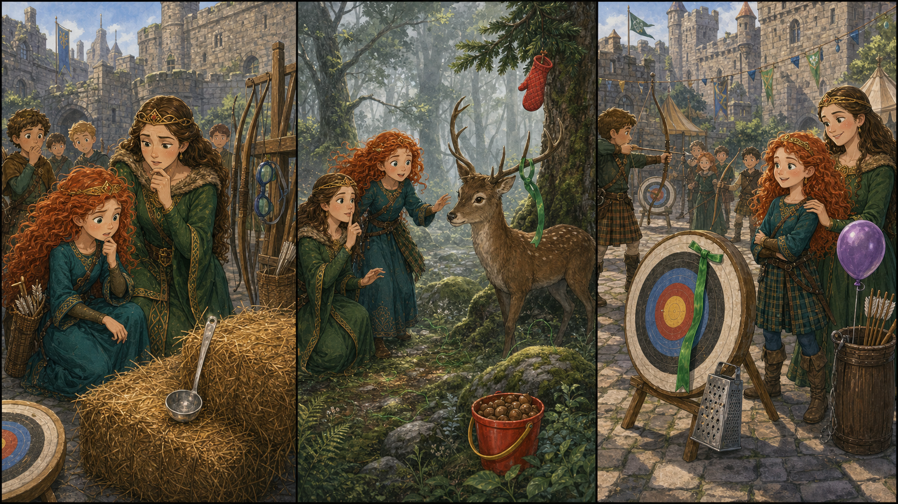

# The Green Target Ribbon

## Part 1: The Practice Day

Merida walks into the castle courtyard with her bow. The morning air is cool, and the stone walls are wet from mist. Young archers wait near the hay bales.

Today is practice day. The children will shoot at the safe target. A green ribbon must hang on that target, so everyone knows where to aim.

The queen looks at the target stand.

"Where is the green ribbon?" she asks.

Merida checks the hay. She checks the bow rack. She checks behind a wooden box.

"It was here last night," Merida says.

The young archers start to talk. One boy holds his arrow too tightly.

"No practice until the ribbon is back," the queen says. "Safety first."

Merida wants to run to every corner of the courtyard, but the queen touches her arm.

"Slow down," she says. "A good hunter also listens."

Merida takes a breath. She hears birds, horses, and the wind. Then she sees a thin green thread on a stone step. It points toward the forest gate.

## Part 2: In the Quiet Wood

Merida and the queen walk into the forest. The trees are tall, and the ground is soft with moss. The green thread appears again on a low branch.

"Something carried it this way," Merida says.

They follow more small threads. Merida moves fast at first, but then she hears a crack.

A young stag stands in the clearing. The green ribbon is caught on one antler. The stag is not hurt, but it looks afraid.

Merida lifts her bow, then stops. This is not a problem for an arrow.

"We need calm hands," the queen whispers.

Merida puts her bow down. She holds out a red apple from her bag. The stag looks at it. The queen steps slowly to the side and frees the ribbon from the antler.

The stag takes the apple and runs into the trees.

Merida smiles. "That was better than running."

"Much better," the queen says.

## Part 3: A Safe First Shot

Back in the courtyard, Merida ties the green ribbon to the safe target. The children stand in a straight line. The queen checks every bow.

"Now we can begin," she says.

The first young archer lifts her bow. She looks nervous.

Merida stands beside her. "Look at the green ribbon. Breathe. Then let go."

The arrow flies through the air and lands in the hay near the target. It is not perfect, but it is safe.

Everyone claps.

Merida looks at her mother. "I wanted to fix it fast."

"And you fixed it well," the queen says.

Merida understands. Being brave is not always loud. Sometimes it means waiting, listening, and helping without making the trouble bigger.

The green ribbon moves in the wind, bright and easy to see. Practice day can finally begin.

## Picture Hunt

There are two funny mistakes in each picture panel. Can you find all six?

## Useful A2 Words

- **target**: something you try to hit or reach.
- **mist**: thin cloud close to the ground.
- **calm**: quiet and not worried.

## Reading Questions

1. What is missing from the safe target?
2. Where does Merida find the ribbon?
3. What does Merida learn from the queen?

## Short Answers

1. The green ribbon is missing.
2. She finds it caught on a young stag's antler.
3. She learns to slow down, listen, and stay calm.
