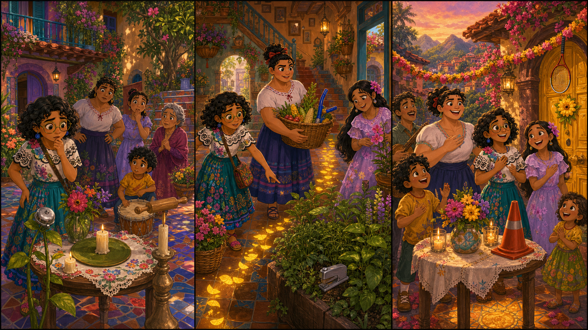

# The Yellow Door Flower

## Part 1: The Welcome Song

Mirabel stands in the courtyard of the magical house. The tiles move softly under her shoes, and bright flowers climb the walls. Today the family will sing a welcome song for new children in the village.

On the small table, there should be a yellow door flower. It is not magic by itself, but it shows where the children can stand.

Mirabel looks at the table.

"The flower is missing," she says.

Isabela brings more flowers from the stairs. Luisa carries benches into the courtyard.

"Maybe it fell," Luisa says.

Mirabel checks under the table. She checks beside the candles. She checks near the front door.

There is no yellow flower.

Then the house taps one tile three times.

Tap. Tap. Tap.

Mirabel smiles. "Casita saw something."

A small yellow petal moves across the floor. It stops near the hallway.

"Come on," Mirabel says. "We have a petal trail."

## Part 2: The Petal Trail

Mirabel, Isabela, and Luisa follow the yellow petals through the house. The hallway is warm and bright. Baskets move a little, as if the house wants to help.

The petals turn toward the kitchen garden.

"I did not put the flower here," Isabela says.

"Maybe someone needed it," Mirabel says.

In the garden, herbs grow in small pots. Corn sits in a basket. The air smells fresh and sweet.

Luisa points to a little table near the wall. A young child from the village is there. She holds the yellow door flower in both hands.

"I am sorry," the child says. "I wanted to see it. It looked friendly."

Mirabel kneels beside her. "It is friendly. It helps everyone know where to begin."

The child gives the flower back.

Isabela adds two new petals to make it stronger. Luisa carries the little table back to the courtyard.

## Part 3: Where We Begin

The family gathers in the courtyard. Mirabel places the yellow flower beside the door. The new children stand near it, just as planned.

"Now everyone has a place," Mirabel says.

The magical house opens its windows. The flowers on the walls move gently. Isabela smiles at the children. Luisa sets the benches down without a sound.

Then the family begins the welcome song.

Mirabel does not sing the loudest, but she sings clearly. The new child stands near the yellow flower and smiles.

After the song, Mirabel gives her a small petal.

"This is for you," Mirabel says. "You helped us remember something."

"What?" the child asks.

Mirabel looks at the door and the family around it.

"A welcome is not just a song," she says. "It is showing people where they can begin."

The house taps the floor once, like it agrees.

## Picture Hunt

There are two funny mistakes in each picture panel. Can you find all six?

## Useful A2 Words

- **welcome**: a kind way to say hello to someone new.
- **petal**: one soft colored part of a flower.
- **clearly**: in a way that is easy to hear or understand.

## Reading Questions

1. What is missing from the small table?
2. Who has the yellow flower in the kitchen garden?
3. What does Mirabel say a welcome can do?

## Short Answers

1. The yellow door flower is missing.
2. A young child from the village has it.
3. A welcome can show people where they can begin.
