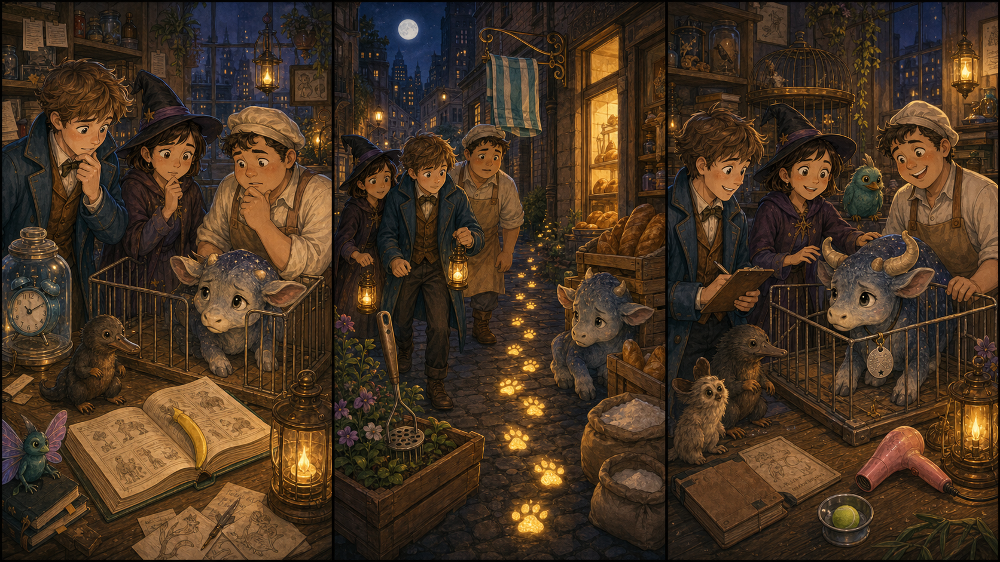

# The Silver Cage Tag

## Part 1: The Evening Check

Newt is in his small magical animal room. The lamps are low, and the shelves are full of careful notes. A shy moon calf stands in a safe pen. It blinks at him with soft eyes.

Every evening, Newt checks each animal. He looks at food, water, and name tags. The tags are small, but they are important. They help everyone know which food and bed belong to each creature.

Newt looks at the moon calf's pen and stops.

"Where is your silver tag?" he asks.

Tina, a young witch, looks under the table. Jacob, the baker, checks near a bag of oats.

"I only see crumbs," Jacob says.

The moon calf makes a tiny sound.

Newt kneels down. "Do not worry. We will find it."

Tina points to the floor. There are three glowing paw prints near the door.

"It looks like our friend went for a walk," she says.

Newt takes a small lantern. "Then we follow the prints slowly."

## Part 2: The Bakery Alley

The paw prints lead them into a moonlit alley behind Jacob's bakery. The stones shine a little after the rain. Warm bread smells come from the window.

Jacob smiles. "Even magical animals like my rolls."

The prints go past flour sacks and stop near some bread crates. Newt hears a soft rustle.

Behind the crates, the moon calf is hiding. It has the silver tag in its mouth. The tag is not broken, but the ribbon is wet.

"Oh," Tina says. "It tried to carry its own tag."

Newt does not grab it. He sits on the ground and waits. Jacob opens a small paper bag.

"Fresh roll?" he asks.

The moon calf steps closer. Newt offers a dry ribbon. The creature drops the silver tag and sniffs the bread.

"Good choice," Jacob whispers.

Tina ties the new ribbon to the tag.

## Part 3: A Safe Name

Back in the animal room, Newt fixes the silver tag to the moon calf's pen. The creature stands beside him and looks calm again.

"There," Newt says. "Now everyone knows this is your safe place."

Jacob puts a few crumbs in the right bowl. Tina checks the door and smiles.

"The night check can begin," she says.

Newt writes a short note in his book. He writes that tags must be tied with dry ribbon after rain.

The moon calf taps the floor once. Newt laughs softly.

"Yes, I learned too."

Jacob looks at the little creature. "Maybe tomorrow it can visit the bakery before bedtime."

Newt shakes his head, but he is smiling. "Only if it wears its tag."

The room becomes quiet. The silver tag shines in the lantern light, and the moon calf sleeps safely in its own pen.

## Picture Hunt

There are two funny mistakes in each picture panel. Can you find all six?

## Useful A2 Words

- **creature**: an animal or living thing.
- **ribbon**: a long, thin piece of cloth.
- **lantern**: a light you can carry.

## Reading Questions

1. What is missing from the moon calf's pen?
2. Where do Newt, Tina, and Jacob find the creature?
3. Why is the silver tag important?

## Short Answers

1. The silver cage tag is missing.
2. They find the creature behind bread crates in the bakery alley.
3. It helps everyone know the creature's safe place.
