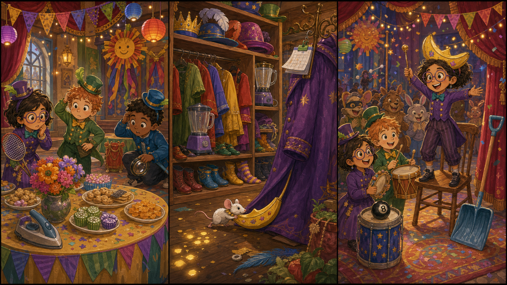

# The Lost Banana Crown

## Part 1: The Small Parade

Kevin stands in a busy hall with Stuart and Bob. Today their new boss wants a small parade. It is not a big parade, but the Minions are very excited.

On the table, there should be a funny banana crown. The boss will wear it for one minute, and then everyone will cheer.

Bob looks at the table and gasps.

"Banana crown?" he says.

It is gone.

Kevin checks under the table. Stuart checks behind the drums. Bob checks inside a snack box, but he only finds cookies.

"No crown," Stuart says.

Kevin tries to stay calm. He points to three tiny yellow paper pieces on the floor.

Bob picks one up. "Crown paper!"

The pieces lead toward the costume room.

"We look," Kevin says.

Stuart holds his little guitar like a detective. Bob carries the snack box, just in case the crown is hungry.

## Part 2: The Costume Room

The costume room is full of hats, coats, shiny shoes, and silly glasses. The paper pieces go past a long mirror and stop near a tall clothes rack.

Something moves behind a purple coat.

Bob jumps back. "Bello?"

A tiny white mouse comes out. It is pulling the banana crown with a piece of string. The crown is too big for the mouse, but it is trying very hard.

Kevin kneels down. He does not shout. The mouse looks afraid.

Stuart plays one soft note on his guitar. The mouse stops.

Bob opens the snack box and takes out one cookie crumb. He puts it on the floor.

The mouse drops the string and eats the crumb.

Kevin takes the crown gently. "Tank yu."

The mouse runs back behind the coats.

## Part 3: One Minute of Glory

The Minions hurry back to the hall. The boss is waiting on the small stage.

Kevin holds up the banana crown. Stuart plays a bright tune. Bob claps with both hands.

The boss puts on the crown. It is a little bent, but it still looks funny. Everyone cheers.

The parade begins. Kevin walks first. Stuart plays music. Bob waves to the mouse, which is now watching from under a chair.

After one minute, the boss gives the crown back.

Kevin puts it in a safe box. Bob adds a cookie crumb beside it.

"For mouse?" Stuart asks.

Bob nods. "Friend."

Kevin smiles. The parade was small, but it worked. They did not need a loud plan. They only needed small clues, soft music, and one cookie crumb.

## Picture Hunt

There are two funny mistakes in each picture panel. Can you find all six?

## Useful A2 Words

- **parade**: a line of people moving together for fun or celebration.
- **costume**: clothes worn to look like someone or something else.
- **gently**: in a soft and careful way.

## Reading Questions

1. What is missing from the table?
2. Who is pulling the banana crown?
3. What helps the mouse feel calm?

## Short Answers

1. The banana crown is missing.
2. A tiny white mouse is pulling it.
3. Soft music and a cookie crumb help the mouse feel calm.
