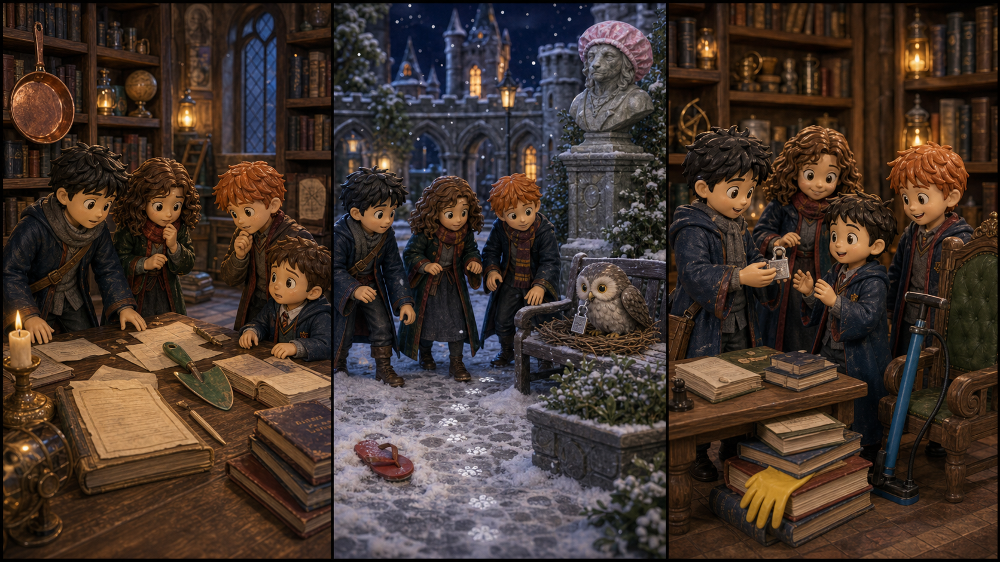

# The Silver Timetable Clip

## Part 1: The Library Table

Harry sits in the library with Ron and Hermione. It is winter, and the windows are white with frost. A first-year student stands beside their table. He looks close to tears.

"I lost my silver timetable clip," he says. "Professor Lupin said I must keep my lessons in order."

Hermione closes her book. "Where did you last see it?"

"Here," the boy says. "On this table."

Ron looks under the chairs. Harry checks beside a pile of old books. Hermione looks at the blank timetable paper. The clip is not there.

Then Harry sees tiny white marks on the table. They look like frost, but the library is warm.

"Look," Harry says. "The marks go to the door."

Hermione nods. "Something cold touched the clip."

The first-year boy looks afraid.

"Do not worry," Harry says. "We will help you find it before study hour."

Ron picks up his school bag. "I hope the cold thing is small."

The frost marks shine softly on the stone floor.

## Part 2: The Snowy Courtyard

The marks lead them outside into the courtyard. Snow lies near the walls, and lanterns shine under the arches. Ron pulls his coat tighter.

"Why would a timetable clip come out here?" he asks.

Hermione points to a bench. "Because something carried it."

On the bench is a small owl. It is not a school owl. It is young and round, with silver feathers near its eyes. The silver clip lies beside its nest of dry grass.

The owl clicks its beak.

Harry steps forward slowly. "We only need the clip."

The owl moves closer to the shiny clip.

Hermione takes a clean ribbon from her bag and puts it beside the nest. The owl looks at the ribbon. It likes soft things more than metal.

After a moment, the owl pulls the ribbon into its nest and leaves the clip.

Ron grins. "Good trade."

Harry picks up the silver timetable clip. It is cold, but safe.

## Part 3: Ready for Study Hour

They return to the library. The first-year student is waiting near the table. His face becomes bright when he sees the clip.

"You found it!" he says.

Hermione fixes the clip to his timetable. "Keep it inside your book when you go outside."

Ron points to the window. "And do not let owls choose your lesson order."

The boy laughs. He puts the timetable into his bag.

Study hour begins. Candles glow along the tables. The library is quiet again.

Harry looks out at the snowy courtyard. The small owl is still on the bench, warm in its ribbon nest.

"It only wanted something soft," Harry says.

Hermione smiles. "Most problems are easier when we look carefully."

Ron opens his book. "And when we carry extra ribbon."

Harry laughs quietly. The silver timetable clip shines on the boy's book, and all his lessons are back in order.

## Picture Hunt

There are two funny mistakes in each picture panel. Can you find all six?

## Useful A2 Words

- **timetable**: a list that shows times for lessons or activities.
- **frost**: thin white ice on a cold surface.
- **carefully**: with attention and care.

## Reading Questions

1. What does the first-year student lose?
2. Where do Harry, Ron, and Hermione find the clip?
3. What does the young owl want for its nest?

## Short Answers

1. He loses his silver timetable clip.
2. They find it in the snowy courtyard near a young owl's nest.
3. The owl wants a soft ribbon.
