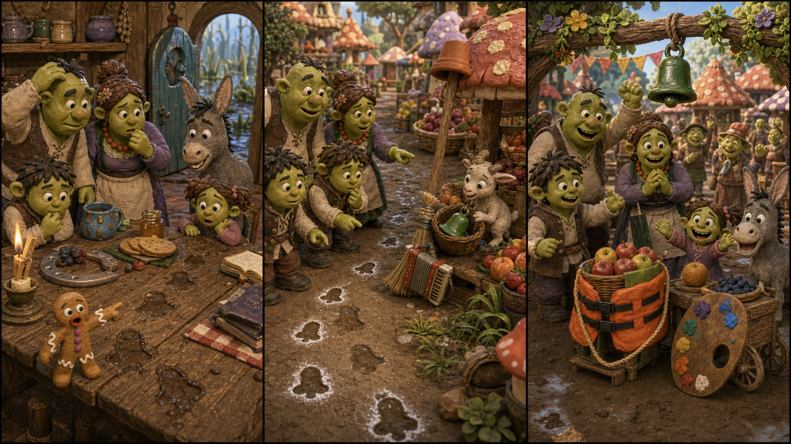

# The Green Market Bell

## Part 1: Breakfast in the Swamp

Shrek sits at the breakfast table with Fiona and the children. Donkey is at the door, talking before anyone asks him a question. Gingy stands on a plate and waves one small arm.

Today the fairy-tale village has a morning market. Shrek must ring the green market bell. When the bell rings, every stall can open.

Fiona looks at the hook by the door.

"Where is the bell?" she asks.

The hook is empty.

Shrek checks under the table. Donkey looks inside a basket. Gingy points to the floor.

"Mud marks!" he says.

There are small muddy shapes on the wood. They look like the bottom of the bell.

Shrek sighs. "Of course the bell walked away."

Fiona smiles. "Bells do not walk, but someone carried it."

The children want to help, but Shrek asks them to stay near the house. He, Fiona, Donkey, and Gingy follow the muddy marks toward the village path.

## Part 2: The Market Path

The market path is full of mushroom stalls, fruit baskets, and sleepy sellers. Nobody can open yet because the bell is missing.

Donkey sniffs the air. "I smell apples. Also trouble. Mostly apples."

The muddy marks go past a broom, around a barrel, and under a small table. Then they stop near a basket of green pears.

Something moves inside the basket.

Fiona lifts the cloth. A tiny goat is there. The green bell is beside it.

"It liked the bell sound," Gingy says.

The goat bumps the bell with its nose.

Ding.

Everyone turns, but Shrek raises one hand.

"Not yet. The market opens when the bell is on the post."

Fiona gives the goat one pear. Donkey gently pushes the basket aside, and Gingy rolls the bell out.

Shrek picks it up carefully. "Thank you, little trouble."

## Part 3: The First Ring

Back at the village square, Shrek hangs the green bell on the market post. Fiona checks the rope. Donkey stands proudly beside the fruit stall. Gingy brushes mud from the bell.

"Ready?" Fiona asks.

Shrek pulls the rope.

Ding! Ding!

The sellers cheer. The market opens. Children run to look at bread, apples, ribbons, and painted cups.

The tiny goat stands near the pear basket. It looks very pleased.

Donkey laughs. "Next time, give the goat its own bell."

Shrek shakes his head. "Next time, we lock the bell up."

Fiona touches his arm. "Or we ask who needs to hear it."

Shrek looks at the goat and smiles. The bell was not stolen to be bad. It was taken because a small creature liked its sound.

The green bell rings again, and the market morning begins.

## Picture Hunt

There are two funny mistakes in each picture panel. Can you find all six?

## Useful A2 Words

- **market**: a place where people buy and sell things.
- **hook**: a curved piece used to hang something.
- **carefully**: with attention and care.

## Reading Questions

1. What is missing from the hook by the door?
2. Where do Shrek and Fiona find the green bell?
3. Why does the tiny goat take the bell?

## Short Answers

1. The green market bell is missing.
2. They find it in a basket near the market path.
3. The goat likes the bell sound.
