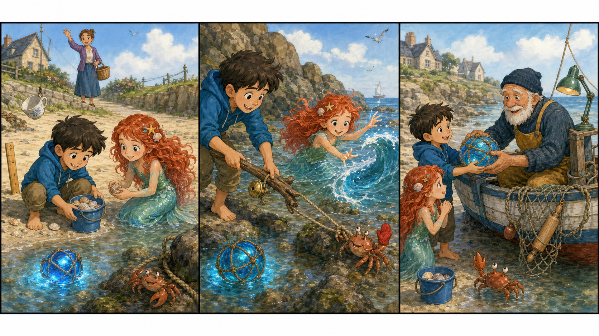

# The Blue Bucket Light

## Part 1: The Small Blue Bucket

The morning sea is calm. Sosuke stands near the water with a small blue bucket. Ponyo sits beside him and looks at the waves.

"Today we collect shells," Sosuke says. "Only empty shells. We do not take homes from sea animals."

Ponyo nods. "Empty shells only."

Lisa is on the road above them. She is taking clean towels to the old people's home. She waves and calls, "Stay near the beach!"

Sosuke and Ponyo walk slowly along the sand. They find white shells, pink shells, and one shell shaped like a tiny cup.

Then Ponyo sees a soft blue light under the water.

"The sea has a star!" she says.

Sosuke looks closely. It is not a star. It is a small glass fishing float. A thin rope is around it, and the rope is caught under a rock.

The blue float moves up and down with the water. A little crab sits on the rope and cannot get away.

Ponyo puts both hands on the bucket. "We help crab."

Sosuke nods. "But we must be gentle."

## Part 2: A Rope in the Rocks

The rock is slippery, so Sosuke does not climb on it. He finds a long piece of driftwood on the beach. Ponyo holds the bucket close.

"Can you ask the water to lift the rope?" Sosuke asks.

Ponyo looks at the waves. She is still learning when to use her magic. She does not want to make a big wave.

"Small water," she says.

A tiny wave comes in. It touches the rope but does not pull hard. Sosuke uses the driftwood to move the rope a little. The crab waves one small claw.

"Again," Sosuke says.

Ponyo smiles. Another small wave comes. This time the rope slips free from the rock. The crab runs into the shallow water.

The glass float rolls toward Ponyo's feet. It shines blue in the sun.

"Pretty," Ponyo says.

Sosuke picks it up carefully. "It may belong to someone."

They look around. Near an old boat, a fisherman is checking a net. He is looking for something in the sand.

## Part 3: Light for the Path

Sosuke and Ponyo carry the glass float to the fisherman. The blue bucket is full of empty shells, and Ponyo walks very proudly.

"Excuse me," Sosuke says. "Is this yours?"

The fisherman looks surprised. "Yes. It fell from my net in the night. Thank you."

He ties the float back on the net. Then he gives Sosuke and Ponyo one clean shell each.

"These are empty," he says. "Good for careful collectors."

Ponyo holds her shell to her ear. "I hear soup."

Sosuke laughs. "Maybe the sea is hungry."

In the afternoon, clouds come over the beach. Lisa drives back along the road and sees the children. The blue float on the fisherman's net shines near the boat. It helps show the safe path by the rocks.

The little crab sits under the water and moves both claws, like it is saying thank you.

Ponyo puts her shell in the blue bucket.

"Empty shells, safe crab, blue light," she says.

Sosuke smiles. "That is a good beach day."

The waves make a soft sound, and the blue light moves gently with the sea.

## Picture Hunt

There are two funny mistakes in each picture panel. Can you find all six?

## Useful A2 Words

- **collect**: to bring things together.
- **gentle**: kind, soft, and not rough.
- **proudly**: in a way that shows you feel happy about something you did.

## Reading Questions

1. What do Sosuke and Ponyo collect on the beach?
2. What is caught under the rock?
3. Who owns the blue glass float?

## Short Answers

1. They collect empty shells.
2. A rope with a little crab is caught under the rock.
3. The fisherman owns the blue glass float.
