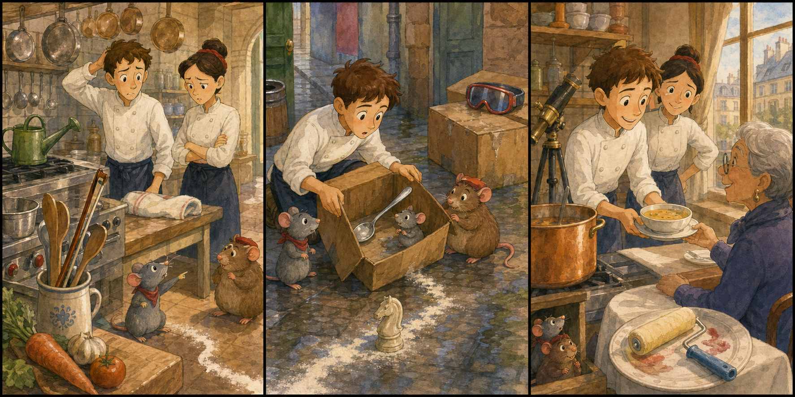

# The Late Soup Spoon

## Part 1: A Quiet Morning

Remy wakes before the sun is high. The restaurant kitchen is quiet, and the silver pots shine on the wall. Linguini is already there. He is holding a list and looking worried.

"Today a food writer is coming," Linguini says. "She wants a simple lunch. Soup, bread, and one small dessert."

Remy nods. Simple food can still be wonderful. He climbs to his little place above the counter and smells the fresh vegetables.

Colette comes in with carrots, onions, and green herbs. "The soup must be ready at twelve," she says. "No drama today."

Linguini smiles. "No drama."

Then he looks at the soup table. The long silver soup spoon is gone.

Colette stops. "Where is it?"

Linguini checks the drawer. Remy looks behind a bowl. Emile, who is visiting for breakfast, looks inside a bread basket.

"Maybe it ran away," Emile says.

Remy points to a small line of flour on the floor. The line goes from the soup table to the back door.

Linguini bends down. "A clue."

Colette takes a deep breath. "Find it fast. The soup cannot wait."

## Part 2: The Flour Line

Remy follows the flour line. Linguini walks behind him with a clean towel. Emile follows too, because the line passes a cheese box.

The trail goes under a shelf, around a bag of potatoes, and past the dish room. At the back door, Remy sees a small spoon mark in the flour.

Outside, the morning street is bright. A delivery boy is putting empty boxes near the wall. One box is moving.

Remy taps Linguini's shoe.

Linguini opens the box. Inside is the missing soup spoon. A tiny mouse is sitting beside it. She is not from Remy's family. She looks scared and hungry.

Emile whispers, "She needed a boat."

The box has water at the bottom from the morning rain. The little mouse used the spoon to stay dry.

Linguini cannot talk to her, but Remy can. He squeaks softly. The little mouse squeaks back.

Remy understands. She is lost and wants to reach the warm wall behind the bakery.

Colette opens the back door. "Did you find it?"

Linguini holds up the spoon. "Yes. And a small problem."

Colette sees the mouse and looks serious. Then she looks at Remy. "We help first. Then soup."

## Part 3: Soup at Twelve

Remy leads the little mouse along a safe pipe behind the kitchen. Emile carries a small piece of bread for her. Linguini cleans the spoon again and again. Colette watches the clock.

At eleven thirty, the soup begins. Remy smells the onions and herbs. He points left, then right. Linguini stirs carefully with the clean silver spoon.

The soup becomes warm and smooth. Colette tastes one small spoonful.

"Good," she says. "Very good."

At twelve, the food writer sits near the window. She has gray hair, round glasses, and a blue notebook. Linguini brings the soup.

The woman takes one spoonful. She smiles.

"This soup tastes kind," she says.

Linguini looks at Remy's hiding place and smiles too.

Later, near the back wall, the little mouse finds her family. Emile waves from a box. Remy feels proud.

The soup spoon is back on the table. It is late, but it has helped someone before lunch.

"No drama today?" Linguini asks.

Colette laughs. "Only a little. And the soup was on time."

## Picture Hunt

There are two funny mistakes in each picture panel. Can you find all six?

## Useful A2 Words

- **writer**: a person who writes stories, notes, or articles.
- **clue**: something that helps you find an answer.
- **carefully**: with attention and care.

## Reading Questions

1. What is missing from the soup table?
2. Why does the little mouse take the spoon?
3. What does the food writer say about the soup?

## Short Answers

1. The long silver soup spoon is missing.
2. She uses it to stay dry in a wet box.
3. She says the soup tastes kind.
