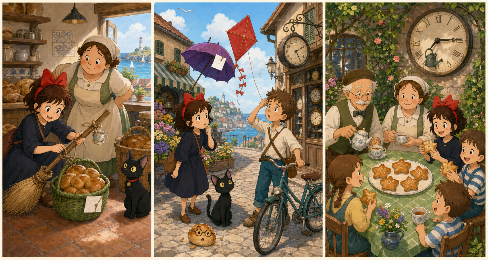

# The Bread Basket Note

## Part 1: A Morning Job

Kiki wakes up early above the bakery. The town is still quiet, but the kitchen is warm. Osono is putting fresh bread into a blue basket.

"Can you take this to the old clock shop?" Osono asks. "The clock keeper is helping with the town picnic today."

Kiki looks into the basket. There are six round breads and a small white note. The note says: FOR THE CLOCK SHOP PICNIC TABLE.

"I can do it before breakfast," Kiki says.

Jiji jumps onto the window. "Before your breakfast, or before my breakfast?"

Kiki laughs. She ties the blue basket to her broom with a soft brown scarf. Then she flies over the roofs. The sea shines far away, and the flower market is opening below.

A sudden wind pushes past the tall bakery sign. The basket swings. The white note slips out and flies away like a little bird.

"Oh no!" Kiki says. "The note!"

She lands near the flower market. She still has the six breads, but the clock keeper may not know who sent them.

Jiji looks at the street. "A note cannot walk far."

Kiki takes a deep breath. "Then we will find it."

## Part 2: The Red Kite

Kiki and Jiji search between flower pots, wooden boxes, and morning carts. A boy with a red kite runs past them.

"Did you see a white note?" Kiki asks.

The boy points up. "Something white is on my kite string!"

The kite is stuck on a low lamp near the clock shop. The white note is tied around the string. It flaps in the wind.

Kiki climbs onto a stone step, but she is still too short. Jiji tries to pull the string with his teeth.

"Careful," Kiki says. "Do not tear it."

Then Tombo rides by on his bicycle. He stops and smiles.

"Need a tall helper?" he asks.

Tombo holds the bicycle steady. Kiki stands on the back wheel step and reaches up. She takes the note from the kite string. It is a little bent, but the words are clear.

"Thank you," Kiki says.

The boy hugs his red kite. "Sorry. The wind was faster than me."

"It was faster than all of us," Kiki says.

Jiji looks at the breads. "The bread is still faster than my breakfast."

## Part 3: The Picnic Table

Kiki carries the basket into the old clock shop. The clock keeper is fixing a small picnic bell on the wall. Many clocks tick softly around him.

"Good morning," Kiki says. "Osono sent six round breads for the picnic table."

She gives him the blue basket and the white note.

The clock keeper reads the note and smiles. "Perfect. The children will come after the bell rings."

Kiki helps put the breads on a clean green cloth. The clock keeper cuts each bread in half. Soon, children come into the shop garden with cups of milk.

Tombo arrives with the boy and the red kite. Osono comes too, carrying a little jar of jam.

"You found the note," Osono says.

Kiki nods. "The wind gave it a short trip."

Jiji sits beside the basket. The clock keeper gives him one tiny bread corner.

"At last," Jiji says.

The picnic bell rings. The children laugh and eat. Kiki feels proud, but also hungry. Osono gives her a warm piece of bread with jam.

"A good delivery," Osono says.

Kiki looks at the blue basket, the white note, and the happy picnic table.

"Next time," she says, "I will tie the note twice."

## Picture Hunt

There are two picture mistakes in each panel. Can you find all six?

## Useful A2 Words

- **basket**: a container used to carry things.
- **picnic**: a meal eaten outside.
- **steady**: not moving or shaking.

## Reading Questions

1. What does Osono ask Kiki to take to the old clock shop?
2. Where does Kiki find the white note?
3. What does Kiki say she will do next time?

## Short Answers

1. She asks Kiki to take a blue basket with six round breads and a note.
2. She finds it on the red kite string near the clock shop.
3. She says she will tie the note twice.
