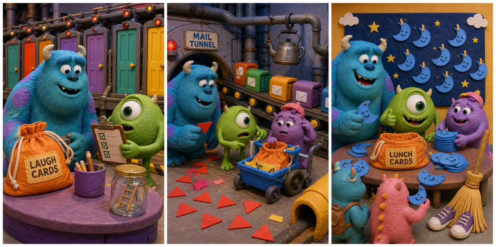

# The Yellow Laugh Bag

## Part 1: Visitor Day

The laugh floor is bright and busy. Doors move slowly on the high rails. Monsters carry papers, cups, and small boxes of colored cards.

Mike stands on a chair with a list in his hand.

"Today is Visitor Day," he says. "Small monsters from school are coming to see how laughs help the city."

Sulley smiles. "That sounds fun."

"It will be fun if we do not lose anything," Mike says.

He gives Sulley a yellow cloth bag. On the front, there is a paper label. It says LAUGH CARDS. Inside the bag are many blue cards. Each card has one kind joke for the visitors to read.

"Please put this on the front table," Mike says. "The children need it after the tour."

Sulley carries the yellow bag carefully. He puts it beside the front table, near a purple cup of pencils.

Then a little green monster rolls a ball under the table. Sulley bends down to help. When he stands up again, the yellow laugh bag is gone.

Mike's eye grows wide. "Please tell me the bag is invisible."

Sulley looks under the table. "No. It is missing."

## Part 2: The Mail Tunnel

Sulley and Mike follow a trail of blue paper curls. The curls go past the water cooler and into the mail tunnel.

"No running," Mike says as he runs.

In the tunnel, small mail boxes move on belts. A soft sound comes from behind a cart.

Rustle, rustle.

Sulley moves the cart and finds a small purple monster. Her name tag says NINA. She is holding the yellow bag. Blue cards are all around her.

"I am sorry," Nina says. "I thought this was the craft bag. I wanted to make paper moons for the classroom wall."

Mike takes one blue card. It has a joke on it, but Nina has cut the edge into a moon shape.

Sulley sits down beside her. "The cards are for Visitor Day. But your moons are nice."

Nina looks worried. "Did I ruin the tour?"

"No," Mike says. "You made it more... round."

Nina laughs. Sulley has an idea. "Can the visitors read the jokes and hang the moon cards after?"

Mike looks at his list. Then he smiles. "That is a good save."

## Part 3: A New Front Table

They carry the yellow laugh bag back to the front table. Sulley writes a new label with a thick black pen: LAUGH CARDS AND MOONS.

Nina helps place the blue moon cards in a neat pile. Mike puts the purple cup of pencils beside them. He also ties a green string to the bag, so it cannot walk away again.

The school visitors arrive. They are small, loud, and very excited. Sulley shows them the doors on the rails. Mike shows them the laugh meter.

At the end, each visitor takes one blue moon card. They read the jokes, laugh, and hang the cards on a wall board. The wall looks like a funny night sky.

The laugh meter shines higher and higher.

Mike whispers to Sulley, "I planned this."

Sulley laughs. "Of course you did."

Nina gives Mike one extra moon card. It says: Why did the sock smile? Because it had a pair of friends.

Mike reads it aloud. The visitors laugh again.

The yellow bag is safe, the wall is bright, and Visitor Day feels like a big happy joke.

## Picture Hunt

There are two picture mistakes in each panel. Can you find all six?

## Useful A2 Words

- **visitor**: a person who comes to see a place.
- **label**: a small paper that tells what something is.
- **trail**: a line of marks that can show where something went.

## Reading Questions

1. What is inside the yellow laugh bag?
2. Where do Sulley and Mike find Nina?
3. What do the visitors do with the blue moon cards?

## Short Answers

1. Many blue joke cards are inside the yellow laugh bag.
2. They find Nina in the mail tunnel behind a cart.
3. They read the jokes and hang the cards on a wall board.
