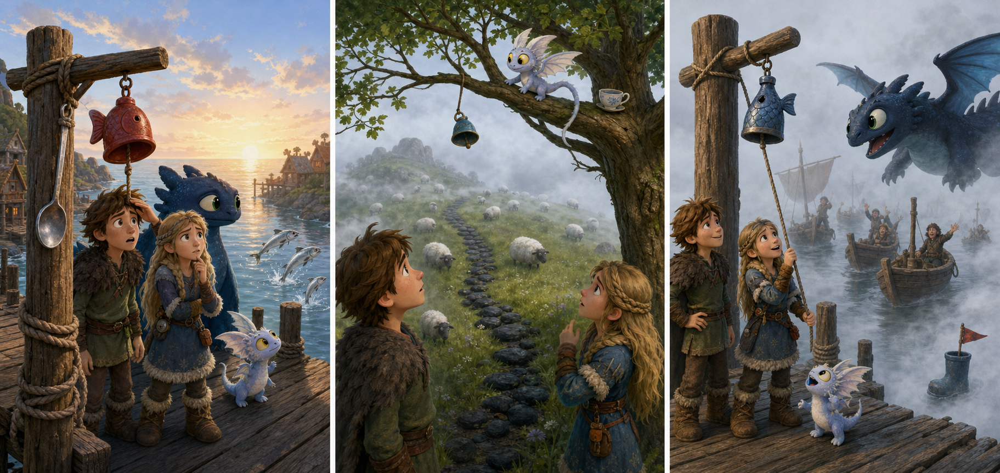

# The Blue Fish Bell

## Part 1: A Bell by the Dock

Hiccup is checking a small fishing dock near the village. The morning air is cold, and the sea is quiet. Toothless sits beside him and watches three silver fish jump near the rocks.

Astrid walks down the dock with a blue hand bell.

"Gobber made this for the fishers," she says. "If fog comes, they can ring it. The sound will help boats find the dock."

Hiccup takes the bell carefully. It is bright blue and shaped like a little fish. It has a short rope handle.

"We should test it before the fishers come back," Hiccup says.

He hangs the blue fish bell on a wooden post. Toothless touches it with his nose.

Ding!

The sound is small but clear. Three gulls fly up from the water.

Then a young dragon called Pebble runs across the dock. Pebble is round, fast, and always curious. He sees the shiny bell and thinks it is a toy. He bites the rope and pulls.

"Pebble, wait!" Astrid says.

Pebble jumps onto a low roof and runs toward the hill. The blue fish bell swings from his mouth.

Hiccup sighs. "The fog bell is lost before the fog arrives."

Toothless stands up and sniffs the cold air. A light fog is already coming from the sea.

## Part 2: The Shell Trail

Hiccup, Astrid, and Toothless follow Pebble's small footprints. The footprints go past the fish baskets and up the hill path.

Astrid points to the ground. "Look. Shells."

A line of white shells sits along the path. Pebble has dropped them from an old basket while running. The shells make a trail toward the sheep field.

In the field, sheep stand like white stones in the fog. Hiccup hears a soft ding, but it does not come from the ground. It comes from a tree.

Pebble is sitting on a wide branch. The blue fish bell hangs from his tail. He looks very pleased.

"That is not a tail bell," Hiccup says.

Pebble shakes his tail.

Ding, ding!

The sheep all look up.

Astrid tries not to laugh. "We need the bell now. The fog is thicker."

Toothless lowers his head. Hiccup climbs onto his back, and they rise slowly beside the tree. Hiccup holds out a dried fish.

"Trade?" he asks.

Pebble smells the fish. He drops the bell into Hiccup's hands and takes the fish.

## Part 3: The Right Sound

Hiccup and Astrid hurry back to the dock. The fog has covered the sea. They cannot see the small fishing boats, but they can hear voices.

"Dock?" someone calls from the water.

Hiccup ties the blue fish bell to the wooden post again. This time, Astrid ties the rope twice.

Hiccup rings the bell.

Ding! Ding! Ding!

The sound moves through the fog. Toothless gives a soft call too. A boat shape appears, then another. The fishers smile when they reach the dock.

Gobber steps out of the first boat. "Good sound," he says. "And good timing."

Pebble runs back with a fish tail in his mouth. He sits under the post and looks at the bell.

"No," Hiccup says kindly. "This bell has a job."

Pebble blinks, then drops a white shell beside the post.

Astrid smiles. "Maybe he wants to help."

Hiccup hangs the shell under the post as a little sign. The blue fish bell rings again, bright and clear.

Now the fishers can find home, and Pebble has a new job: shell keeper.

## Picture Hunt

There are two picture mistakes in each panel. Can you find all six?

## Useful A2 Words

- **fog**: thick cloud near the ground or sea.
- **dock**: a place where boats stop.
- **trade**: to give one thing and get another thing back.

## Reading Questions

1. What does Gobber make for the fishers?
2. Where do Hiccup and Astrid find Pebble with the bell?
3. How does Hiccup get the bell back from Pebble?

## Short Answers

1. He makes a blue fish bell for the fishers.
2. They find Pebble in a tree near the sheep field.
3. Hiccup trades a dried fish for the bell.
