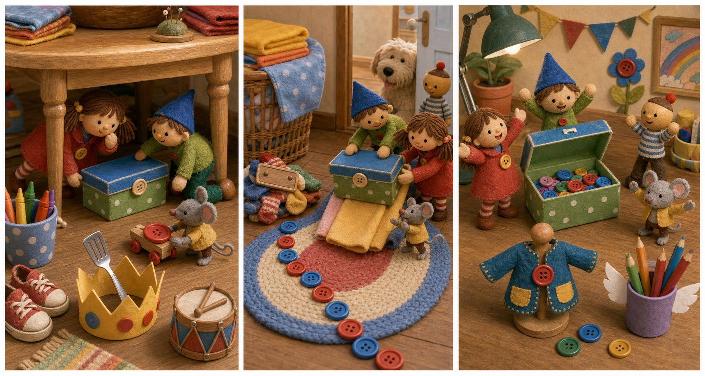

# The Green Button Box

## Part 1: A Box Under the Bed

Bonnie's room is sunny after lunch. The toys hear Bonnie and her mother talking in the hall.

"We can fix the puppet jacket later," Bonnie's mother says. "I need the green button box."

Bonnie runs into the room and looks under the bed. She pulls out shoes, a paper crown, and a small drum. But the green button box is not there.

When Bonnie leaves, Woody calls the toys together.

"That box is important," he says. "Bonnie wants to fix something."

Buzz stands tall on the rug. "Search mission."

Jessie checks near the book shelf. Rex looks behind a pillow. Forky looks inside a cup and waves.

"No buttons in here," Forky says. "Only crayons."

Bo Peep points to the window seat. "I saw Bonnie use the box yesterday. It had green sides and a yellow lid."

Woody nods. "Then we look for green sides and a yellow lid."

At that moment, a toy car rolls out from under the bed. It bumps into Woody's boot. On its roof is one small red button.

Jessie picks it up. "A clue."

## Part 2: The Laundry Basket

The toys follow a trail of buttons across the rug. There is a red button, a blue button, and two white buttons. The trail goes to the laundry basket near the door.

Buzz climbs onto a sock mountain. "I see something yellow."

Woody and Jessie pull together. A yellow lid appears between two clean towels. Under it is the green button box.

"Found it!" Rex whispers too loudly.

But the box is too heavy. It is full of buttons, ribbon pieces, and a tiny sewing card.

Forky climbs onto the lid. "I can help by being light."

"That is not very helpful," Jessie says, smiling.

Bo Peep has an idea. She uses her shepherd's staff to hook the handle of the box. Buzz and Woody push from behind. Jessie pulls a towel like a slide.

The green box moves slowly down the towel and onto the floor.

Then the door opens a little. Bonnie's dog, Buddy, puts his nose into the room. The toys freeze.

Buddy sniffs the box. One button sticks to his wet nose.

The dog walks away with the blue button on his nose.

Woody whispers, "New mission. Save the button."

## Part 3: Back on the Desk

Buddy stops beside Bonnie's desk and shakes his head. The blue button falls onto a homework paper.

Buzz slides down the chair leg. Jessie jumps onto the desk from a stack of books. Forky rides in a pencil cup, which rolls a little and stops.

Woody picks up the blue button. "Good catch, team."

They push the green button box under the desk, then up onto a low foot stool. Bo Peep uses her staff to lift the handle. Buzz counts.

"Three, two, one, push!"

The box lands on the desk with a soft thump. Woody puts the blue button inside and closes the yellow lid.

The toys return to their places just before Bonnie comes back.

"Mom! I found it!" Bonnie says. She sees the green button box on the desk. "Maybe I left it here."

She opens the box and chooses a blue button for the puppet jacket.

Woody smiles from the rug. Buzz gives a tiny salute. Forky looks proud.

"I helped by being light," Forky whispers.

Jessie laughs quietly. "You sure did."

Bonnie starts to fix the jacket, and the toys rest after a very button-filled mission.

## Picture Hunt

There are two picture mistakes in each panel. Can you find all six?

## Useful A2 Words

- **button**: a small round thing used to close clothes.
- **mission**: an important job to do.
- **heavy**: hard to lift or move.

## Reading Questions

1. What does Bonnie need to find?
2. Where do the toys find the green button box?
3. What does Bonnie choose for the puppet jacket?

## Short Answers

1. She needs to find the green button box.
2. The toys find it in the laundry basket.
3. She chooses a blue button.
