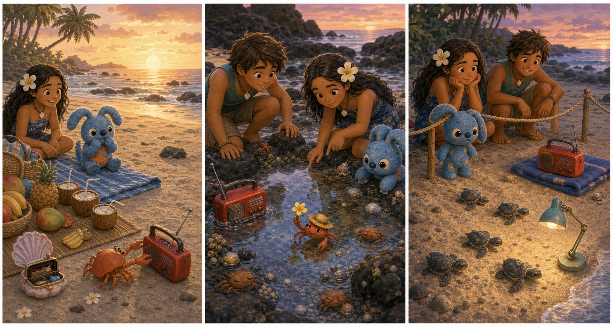

# The Yellow Beach Radio

## Part 1: Music Before Sunset

Lilo puts a yellow beach radio on a blue towel. The beach is warm, and the sky is turning pink. Nani is setting cups on a small picnic mat.

"Only quiet music," Nani says. "The baby sea turtles will come out soon."

Lilo nods. "Soft music. Promise."

Stitch sits beside the towel and looks at the radio. He wants to press every button. Lilo gently moves his hand away.

"Not too loud," she says.

David brings a basket with fruit and sandwiches. "The turtle group will meet near the rope line."

Lilo turns the radio on. A soft song plays. The beach feels calm.

Then a strong wind blows across the sand. The blue towel flips up. The yellow radio rolls off the towel and bumps into a pile of smooth stones.

Stitch jumps after it, but a small crab runs out from the stones. The crab pushes the radio with one claw and runs toward the rocks.

"Hey!" Lilo says. "That is not a crab house!"

The crab disappears between two black rocks. The song stops.

Nani looks at the darkening beach. "We need the radio back before the turtle walk."

## Part 2: The Rock Pool

Lilo, Stitch, and David search near the rocks. They move slowly because small shells and sleeping crabs are everywhere.

Stitch points to a line in the sand. It is a trail from the radio, with tiny square marks from the speaker holes.

"Good eyes," Lilo whispers.

The trail leads to a shallow rock pool. The yellow radio is sitting on a dry stone in the middle. The crab is beside it, waving a claw at its reflection.

Lilo kneels by the pool. "Maybe it likes music."

David smiles. "Or maybe it likes yellow things."

Stitch reaches for the radio, but Lilo stops him. "Slow hands."

She takes one small yellow flower from her hair and places it near the crab. The crab walks to the flower and taps it.

Stitch carefully picks up the radio. It is sandy but dry.

"Thank you, crab," Lilo says.

The crab lifts the flower like a tiny flag.

## Part 3: A Soft Turtle Song

They bring the yellow radio back to the blue towel. Nani checks it and wipes the sand from the side.

"Still works," she says.

Lilo turns the sound very low. A slow, soft song comes out. Stitch sits on both hands so he will not press the buttons.

Soon, the turtle group stands behind the rope line. The beach is quiet. One tiny sea turtle moves across the sand, then another. Everyone watches without touching them.

Lilo smiles at Stitch. "See? Quiet can be exciting."

Stitch nods. "Quiet good."

David points to the rocks. The crab is there with the yellow flower. It moves one claw slowly, like it is dancing.

Nani laughs softly. "Even the crab likes the song."

The last turtle reaches the water. The waves carry it away under the pink sky.

Lilo turns off the yellow radio and holds it close.

"Tomorrow," she says, "we can play music for breakfast. The crab is not invited to carry it."

Stitch grins. "Crab guest. No carry."

## Picture Hunt

There are two picture mistakes in each panel. Can you find all six?

## Useful A2 Words

- **radio**: a small machine that plays music or voices.
- **reflection**: a picture of something seen in water or glass.
- **whisper**: to speak very quietly.

## Reading Questions

1. What color is Lilo's beach radio?
2. Where do Lilo, Stitch, and David find the radio?
3. Why does Stitch sit on both hands?

## Short Answers

1. The beach radio is yellow.
2. They find it on a dry stone in a shallow rock pool.
3. He sits on both hands so he will not press the buttons.
