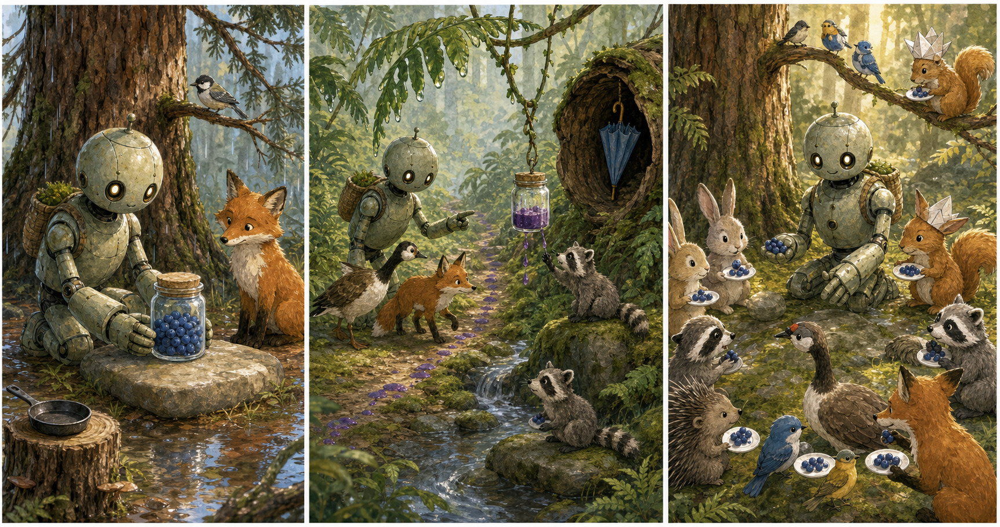

# The Glass Berry Jar

## Part 1: A Quiet Forest Morning

Roz stands near the edge of the forest. The sun is low, and the leaves are wet with morning rain. Brightbill sits on a branch and shakes water from his feathers.

"The young animals are coming for breakfast," Brightbill says. "They will be hungry."

Roz holds a glass jar in her metal hands. The jar is full of red berries. She picked them before sunrise and washed them in the stream.

"The berries are ready," Roz says. "I will put them on the flat stone."

Fink runs out from behind a log. His nose moves quickly.

"Red berries?" he asks. "I can check if they are good."

"You checked the last basket," Brightbill says.

Roz places the glass berry jar on the flat stone near the old pine tree. Then she hears a soft sound in the bushes.

Tap. Tap. Tap.

A little porcupine is trying to move a fallen stick. Roz walks over to help. When she comes back, the glass jar is gone.

Fink's ears go up. "I did not take it."

Brightbill looks at the wet ground. "There are berry drops."

A small line of red berry juice leads away from the flat stone and into the fern path.

Roz turns her head. "Then we will follow the drops."

## Part 2: The Fern Path

Roz, Brightbill, and Fink follow the red drops through tall ferns. The forest is quiet except for dripping leaves and bird calls.

The drops stop beside a hollow log. Roz kneels and looks inside. The glass jar is not there, but one berry sits on the moss.

Fink sniffs. "Someone small came this way."

Brightbill flies to a low branch. "I see it!"

The glass jar is hanging from a vine near a stream. A young raccoon is sitting under it with red berry juice on his paws.

"I am sorry," the raccoon says. "I wanted to carry the jar to my sister. She hurt her foot."

Roz looks across the stream. A smaller raccoon sits on a dry stone and waves.

"You should have asked," Brightbill says.

The young raccoon looks down. "I was afraid there would not be enough."

Roz takes the jar from the vine. "There are enough berries when we share them."

Fink nods slowly. "Sharing also means I get some, yes?"

Roz gives him one berry. "Yes."

## Part 3: The Berry Breakfast

Roz carries the glass jar back to the flat stone. Brightbill flies ahead to call the young animals. Fink walks beside the raccoons and tells them which berries are sweetest.

Soon, rabbits, squirrels, birds, and the little porcupine come to the old pine tree. Roz puts the red berries on big green leaves.

The raccoon with the hurt foot sits on a soft bed of moss. Roz gives her the first leaf of berries.

"Thank you," the small raccoon says.

The young raccoon touches the glass jar. "I will ask next time."

"That is a good plan," Roz says.

Brightbill drops one red berry beside the jar. "This one is for the finder."

Fink smiles. "I found many drops."

"We all found the way," Brightbill says.

The forest breakfast begins. The animals eat slowly and talk softly. The glass jar shines in the morning light.

Roz watches the group. Her body is still and quiet, but inside she feels something warm.

"Shared food makes a safer forest," she says.

Fink licks berry juice from his nose. "And a sweeter one."

## Picture Hunt

There are two picture mistakes in each panel. Can you find all six?

## Useful A2 Words

- **jar**: a glass container with a wide top.
- **share**: to let others have or use some of something.
- **hollow**: empty inside.

## Reading Questions

1. What is inside Roz's glass jar?
2. Why does the young raccoon take the jar?
3. Where do the animals eat the berries?

## Short Answers

1. Red berries are inside the glass jar.
2. He wants to carry berries to his sister because she hurt her foot.
3. They eat near the old pine tree on big green leaves.
