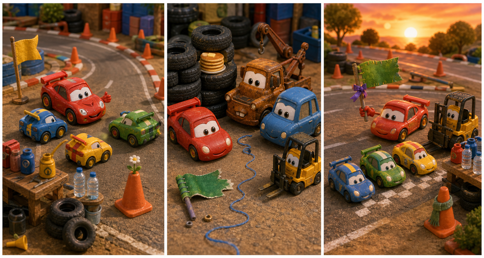

# The Green Pit Stop Flag

## Part 1: A Windy Practice Day

Lightning McQueen rolls into the small practice track near Radiator Springs. The morning wind moves dust across the road. Mater is waiting beside a table with oil cans, water bottles, and a green pit stop flag.

"Today is not about speed," Sally says. "It is about helping the young racers stop safely."

Lightning looks at the green flag. "When I wave this, they come to the pit stop slowly."

"Slowly is a good word," Mater says. "I say it often when I go fast by mistake."

Three young race cars line up by the orange cones. They are excited and loud. Lightning wants to teach them well.

He puts the green flag on the table and drives to the first cone. He shows the young racers how to turn, brake, and stop near the pit line.

Then the wind becomes stronger. A big dust swirl jumps across the track. The table shakes. The green flag slides off and flies toward the old tire stack.

"My flag!" Lightning calls.

Mater drives after it, but the flag is gone. Only its wooden handle lies in the dust.

Sally looks at the track. "We need that flag before the young racers try again."

Lightning sees small green cloth threads on the ground. They point toward the tire stack.

"Then we follow the threads," he says.

## Part 2: The Tire Stack Clue

Lightning, Mater, and Sally follow the green threads to the old tire stack. The tires are tall and dark. The wind makes a low sound inside them.

Mater looks nervous. "Maybe the flag is hiding."

Lightning shines his headlights between the tires. He sees something green, but it is too far inside.

Then a little forklift rolls out from behind the stack. His name is Niko, and he is carrying the green flag on his forks.

"Sorry," Niko says. "I found it in the dust. I wanted to bring it back, but the wind pushed me here."

Sally smiles. "Thank you for saving it."

Niko looks at the flag. "It has a tear."

The corner of the green cloth is ripped. Lightning feels worried. The young racers are waiting.

Mater thinks for a moment. "I have a clean bandage sticker in my tow box."

"For cars?" Lightning asks.

"For signs, flags, and sometimes sandwiches," Mater says.

Sally helps put the sticker on the torn corner. Niko holds the handle steady. Soon the flag can wave again.

## Part 3: A Safer Stop

Back at the practice track, the young racers are quiet. They watched the wind and the lost flag. Now they understand that stopping safely matters.

Lightning waves the green pit stop flag. The first young racer comes around the turn. She slows down, passes the orange cone, and stops at the line.

"Nice and easy!" Lightning says.

The next racer does the same. The last racer comes in too fast, but he sees the flag and remembers to brake early.

Mater cheers. "That was slower than a turtle in a library!"

Everyone laughs.

Niko stands beside the table and holds the flag when Lightning is teaching. Sally ties a small green ribbon to the handle, so the flag is easier to see.

The wind still blows, but the team is ready. The young racers practice again and again. No one crashes into the cones.

At sunset, Lightning parks beside the repaired flag.

"Today we learned a new race rule," he says. "A good stop can be as important as a fast start."

Mater nods. "And a good sticker can save the day."

## Picture Hunt

There are two picture mistakes in each panel. Can you find all six?

## Useful A2 Words

- **practice**: to do something again so you get better.
- **brake**: to slow down or stop a car.
- **steady**: held still and not moving.

## Reading Questions

1. What does Lightning use to call the racers to the pit stop?
2. Who finds the green flag near the tire stack?
3. What does Sally tie to the flag handle?

## Short Answers

1. He uses a green pit stop flag.
2. Niko, a little forklift, finds the flag.
3. She ties a small green ribbon to the handle.
