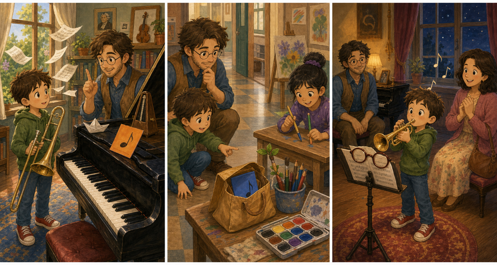

# The Blue Practice Note

## Part 1: A Note on the Piano

Joe opens the music room door after school. The room is quiet, and sunlight sits on the piano keys. Connie is waiting with her trombone case.

"I want to play for my aunt tonight," Connie says. "But I keep forgetting the middle part."

Joe smiles. "Then we make a practice plan."

He writes three short steps on a blue note card. First, hum the tune. Second, clap the rhythm. Third, play slowly.

Joe puts the blue practice note on the piano. "This will help you remember."

Connie hums the tune. It sounds soft at first, then stronger. Joe taps the beat with one finger.

Then the music room window opens with a little bang. A warm wind lifts papers from the desk. The blue practice note flips into the air and flies under the door.

"The note!" Connie says.

Joe opens the door, but the hallway is busy. Students walk past with backpacks and art folders.

Connie looks worried. "I need those steps."

Joe points to a small blue corner near the water fountain. "We can find it. Music is not only in a note. It is also in our ears."

## Part 2: The Hallway Rhythm

Joe and Connie follow the blue paper corner down the hall. It is not the whole note, only a torn piece. Still, it points them toward the art room.

Near the art room, a boy is tapping pencils on a desk. Tap, tap, rest. Tap, tap, rest.

Connie stops. "That sounds like my rhythm."

Joe nods. "Good listening."

The boy sees the torn blue corner. "Oh! A blue card flew into my paint box. I used it to keep paint off the table."

He shows them the card. It has paint on one side, but Joe's words are still clear on the other side.

Connie reads the first step. "Hum the tune."

She hums the middle part in the hallway. A younger student walking by smiles and hums the last note with her.

Joe claps the rhythm. Connie claps with him. Now she remembers the second step too.

"The card is messy," Connie says.

"Music can be messy before it is ready," Joe says.

They carry the blue practice note back to the music room.

## Part 3: The Small Evening Song

In the music room, Joe puts the blue note on the piano again. This time, he places a small music book on one corner so it cannot fly away.

Connie stands beside the piano and takes a slow breath. She hums the tune first. Then she claps the rhythm. Last, she plays the middle part slowly on her trombone.

The sound is not perfect, but it is warm and brave.

"Again?" Joe asks.

Connie nods. "Again."

After three tries, the middle part is clear. Connie smiles so much that she almost laughs into the trombone.

That evening, her aunt comes to the school music room. Joe sits near the piano. Connie looks at the blue practice note one last time.

She plays the small song. The middle part comes at the right time. She does not stop.

When the song ends, her aunt claps softly.

"That was beautiful," her aunt says.

Connie looks at Joe. "The note helped."

Joe points to her ears and heart. "You helped too."

The blue practice note stays on the piano, a little painted and a little bent, but very useful.

## Picture Hunt

There are two picture mistakes in each panel. Can you find all six?

## Useful A2 Words

- **rhythm**: the pattern of beats in music.
- **tune**: the main music notes in a song.
- **brave**: ready to do something even when you feel nervous.

## Reading Questions

1. What does Joe write on the blue note card?
2. Where does the boy find the blue card?
3. Who listens to Connie play in the evening?

## Short Answers

1. He writes three practice steps.
2. He finds it in his paint box.
3. Her aunt listens to her play.
