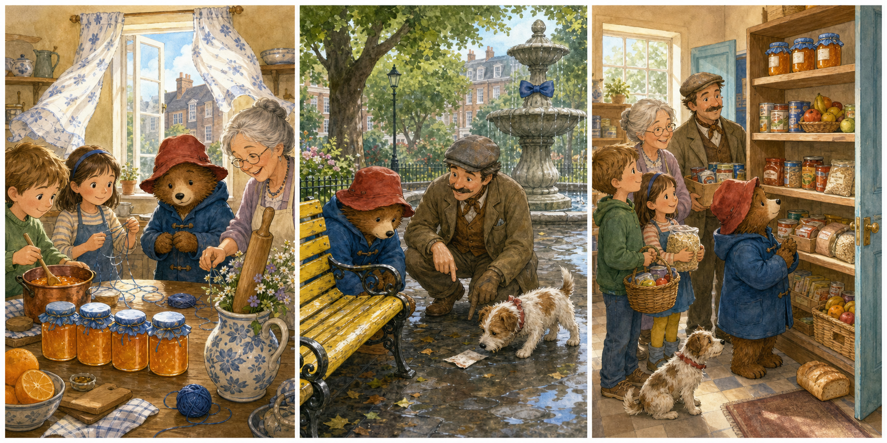

# The Missing Marmalade Label

## Part 1: Three Jars in the Kitchen

Paddington stands on a chair in the Brown family's kitchen. Mrs Bird is making marmalade for the community food shelf. The room smells sweet and warm.

"We have three jars," Mrs Bird says. "Each jar needs a white label."

Paddington writes MARMALADE on three small white labels. His letters are slow but careful. Judy ties a blue string around each jar.

"They look ready," Jonathan says.

Mrs Bird opens the window because the kitchen is hot. A strong wind moves the curtains. One white label lifts from the table and flies out of the window.

Paddington reaches for it, but it is too late.

"Oh dear," he says. "A jar without a label may look like orange soup."

He looks at the table. Two labels are still there. The third jar has only its blue string.

Mrs Brown checks the clock. "We need to take the jars to the community hall before lunch."

Paddington puts on his hat. "Then I will find the missing label."

Outside the window, he sees a tiny orange spot on the garden path. A little marmalade was on the back of the label.

"A sticky clue," Paddington says.

## Part 2: The Green Bench

Paddington follows small orange spots along the street. They pass a flower shop, a bus stop, and Mr Gruber's antique shop.

Mr Gruber is sweeping the pavement.

"Good morning, Mr Brown," he says. "Are you following jam?"

"Marmalade," Paddington says. "It is a very important difference."

Mr Gruber points toward the park. "I saw a piece of white paper flying that way."

Paddington walks to the green bench near the fountain. The missing label is stuck under the bench. A small terrier is trying to pull it free with one paw.

"Thank you for finding it," Paddington tells the dog.

The label is wet at one corner. The word MARMALADE is still clear, but the paper will not stick to the jar now.

Mr Gruber takes a clean paper clip from his pocket. "This may help."

Paddington clips the label to the blue string.

"A label does not need to be perfect," Mr Gruber says. "It only needs to tell the truth."

Paddington smiles. "And this one tells a very sticky truth."

## Part 3: The Community Shelf

Paddington carries the label home. Mrs Bird clips it to the third jar and places all three jars in a basket.

At the community hall, Mrs Brown puts the jars on the bottom shelf. There are tins, bread, rice, and fruit nearby.

A woman who helps at the hall reads the labels.

"Three jars of marmalade," she says. "These will make breakfast brighter."

Paddington looks at the repaired label. Its wet corner is bent, and the paper clip shines beside the blue string.

"This jar had a short adventure," he says.

Jonathan points to a small orange mark on Paddington's coat. "So did you."

Paddington tries to clean it with his paw, but the mark becomes bigger. Everyone laughs.

Mrs Bird gives him a warm piece of toast with a little marmalade.

"For the label finder," she says.

Paddington takes one bite. "Finding things is easier after breakfast."

The three jars sit safely on the bottom shelf, each with a white label and blue string. Even the missing label is back where it belongs.

## Picture Hunt

There are two picture mistakes in each panel. Can you find all six?

## Useful A2 Words

- **label**: a piece of paper that tells what something is.
- **shelf**: a flat place used to hold things.
- **clip**: to fasten something with a small metal or plastic tool.

## Reading Questions

1. How many marmalade jars does Mrs Bird make?
2. Where does Paddington find the missing label?
3. Where does Mrs Brown put the jars at the community hall?

## Short Answers

1. She makes three marmalade jars.
2. He finds it under the green bench near the fountain.
3. She puts them on the bottom shelf.
