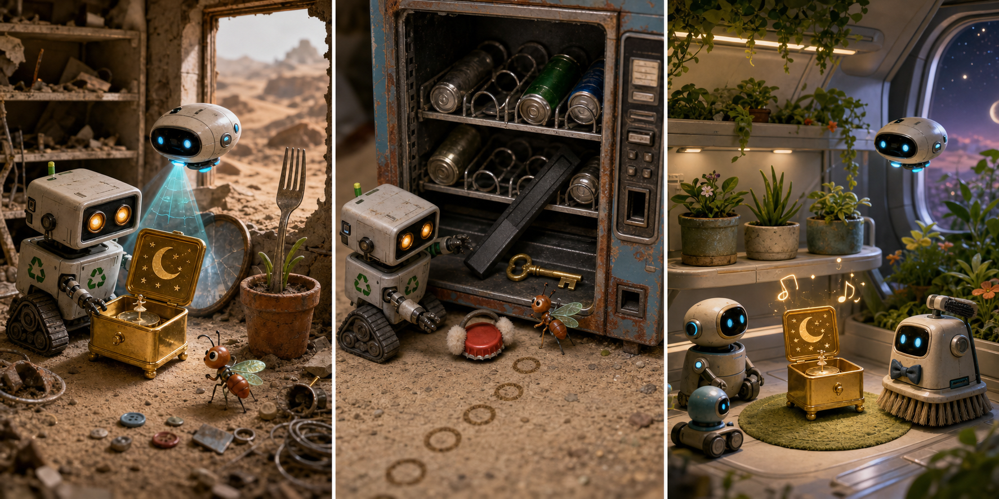

# The Small Music Box

## Part 1: A Silver Box in the Dust

WALL-E rolls past an old shop on Earth. The windows are broken, and sand covers the floor. He is looking for useful things to take home.

Under a fallen shelf, he finds a small silver box. A blue moon is painted on the lid.

WALL-E wipes away the dust. He opens the box, but there is no music. On one side, there is a tiny empty hole.

EVE flies through the broken window.

"EVE," WALL-E says. He shows her the box.

EVE scans it with a blue light. A picture appears: the box needs a small brass key.

WALL-E looks under the shelf. He finds buttons, wire, and a round mirror, but no key.

His little cockroach friend runs across the floor and stops beside a mark in the dust. The mark looks like a small star.

WALL-E sees another star mark near the door. Then he sees a third one beside an old vending machine.

The key made the marks when it moved across the floor.

WALL-E closes the silver box carefully and puts it inside his chest space.

EVE points toward the star marks.

They begin to follow the trail.

## Part 2: The Magnet Inside

The star marks stop at the old vending machine. Its front is open, but the space inside is dark.

WALL-E shines his small light. He sees metal cans, a red bottle cap, and a long black magnet.

Something bright is stuck to the magnet.

"Key!" WALL-E says.

The brass key is too far inside. WALL-E reaches with one arm, but he cannot touch it. EVE tries to pull the magnet, but it is caught under a metal bar.

The cockroach runs into the machine. It climbs onto the red bottle cap and pushes it. The cap rolls against the metal bar.

Clink!

The bar moves a little.

WALL-E uses a flat metal strip to lift the bar. EVE pulls the magnet free. The brass key drops onto WALL-E's hand.

He turns it slowly. It is small and warm from the sun.

EVE smiles. The cockroach stands proudly on the bottle cap.

WALL-E puts the key into the silver music box. He turns it once.

A few soft notes play, then stop.

The box still works.

## Part 3: Music in the Garden

Later, WALL-E and EVE bring the silver music box to the garden on the ship. Four green plant pots stand on a middle shelf.

WALL-E places the box beside the pots. He turns the brass key three times.

The blue moon on the lid moves in a slow circle. A gentle song fills the garden.

Small service robots stop their work and listen. One robot moves its brushes like dancing arms. Another robot turns slowly beside the plants.

EVE floats close to WALL-E. She touches his hand.

The song is short, but no one moves until the last note is gone.

WALL-E opens the box again. Inside, a tiny metal moon rests under a silver star.

He looks at the real plants, then at EVE.

"Music," he says.

EVE nods. "Music."

WALL-E puts the key in a small pocket beside the box so it will not be lost again.

The silver music box stays on the middle shelf near the four plants. Every evening, WALL-E turns the key, and the quiet garden gets its own small song.

## Picture Hunt

There are two picture mistakes in each panel. Can you find all six?

## Useful A2 Words

- **magnet**: a piece of metal that pulls some other metals toward it.
- **trail**: a line of marks that shows where something went.
- **gentle**: soft, calm, and not strong.

## Reading Questions

1. What color is the small music box?
2. Where is the brass key stuck?
3. How many plant pots stand on the middle shelf?

## Short Answers

1. The music box is silver.
2. The brass key is stuck to a magnet inside the vending machine.
3. Four plant pots stand on the middle shelf.
