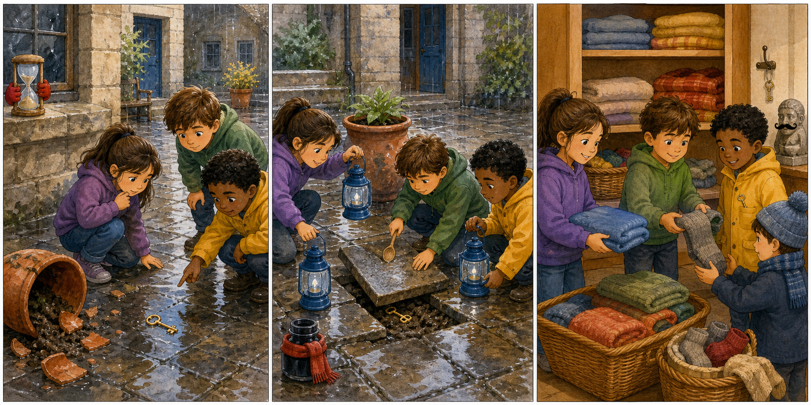

# Harry Potter and the Deathly Hallows Part 2: The Silver Courtyard Key

## Part 1: The Quiet Courtyard

The school was very busy, but one small courtyard was quiet. The stone floor was wet from morning rain. A broken plant pot sat near the wall, and two blue lanterns hung beside an old window.

Harry, Hermione, and Neville came into the courtyard with careful steps. Professor McGonagall had asked Neville to find a small silver key. It opened a cupboard with warm blankets and extra socks. Some first-year students were cold in the safe room, so the key was important.

"I put it in my left coat pocket," Neville said. He touched the pocket and made a worried face. "But now it is gone."

Hermione looked at the wet stones. "Did you run here?"

"No," said Neville. "I carried two lanterns. Then I moved that plant pot because it was in the way."

Harry bent down. He saw a small bright mark on the floor. It was not gold. It was silver, like moonlight.

"Maybe the key fell here," he said.

A little wind moved through the courtyard. The blue lanterns swung softly. The broken plant pot made a slow scraping sound.

Neville stepped back. "Did the pot move?"

Hermione smiled. "Maybe something is under it."

They all looked at the pot. It was heavy, and the wet soil inside made it heavier. But the key might be there, and the cold students were waiting.

## Part 2: The Plant Pot Clue

Neville took one lantern from the wall. Harry took the other. The blue light made the wet floor shine. Hermione opened her bag and took out a small cloth.

"We should not cut our hands on the broken edge," she said.

Together, they pushed the plant pot a little to the side. A thin silver line appeared under it. Neville's eyes grew wide.

"That is my key!"

But the key was stuck under a stone tile. Only the round top showed. Harry tried to pull it with two fingers, but it did not move.

Hermione touched the stone. "The rain made the mud hard. We need to loosen it."

Neville ran to the window and found a small wooden spoon from a garden box. He used it to move the mud. Harry held the lantern low, and Hermione kept the cloth near the sharp edge.

After a minute, the key came free with a small pop. Neville caught it before it fell into a puddle.

"Thank you," he said. "I was sure I had lost it forever."

"You found the clue," Harry said. "We only helped."

Neville smiled. Then he stopped smiling. "The cupboard is on the other side of the hall. We must hurry."

## Part 3: Warm Socks for Everyone

They walked quickly but quietly. The school halls were full of noise, so they stayed close to the wall. Neville held the silver key in both hands. He did not want to lose it again.

At the blanket cupboard, the key turned easily. Inside were folded blankets, clean towels, and many pairs of thick grey socks.

"Grey socks are not exciting," Harry said.

"They are exciting when your feet are cold," Hermione answered.

Neville laughed. He filled a small wooden box with blankets and socks. Harry carried one side of the box, and Hermione carried the other.

When they reached the safe room, a small girl wrapped a blanket around her shoulders. "This is warm," she said.

Neville gave her a pair of socks. "These are warm too."

Professor McGonagall came to the door. She looked at the box, the key, and Neville's muddy hands.

"Well done," she said. "A small key can do a large job."

Neville put the silver key back on its hook, not in his pocket. He also wrote a note and placed it beside the hook: Key here.

Harry read the note and smiled. "Good plan."

Outside, the blue lanterns still shone in the quiet courtyard. The rain had stopped. The stone floor looked clean, and the lost key had become a small happy story.

## Picture Hunt

There are two picture mistakes in each panel. Can you find all six?

## Useful A2 Words

- **courtyard**: an open space inside or beside a building.
- **cupboard**: a small place with doors for keeping things.
- **puddle**: a small pool of water on the ground.

## Reading Questions

1. What did Neville need to find?
2. Where was the key stuck?
3. What did Neville put beside the key hook?

## Short Answers

1. He needed to find a small silver key.
2. It was stuck under a stone tile.
3. He put a note beside the hook.
