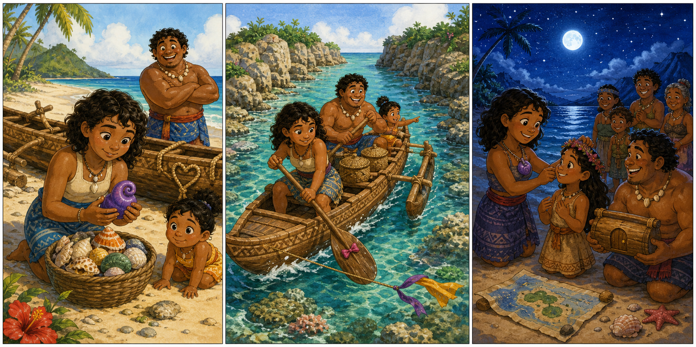

# Moana 2: The Green Wave Shell

## Part 1: A New Morning Song

The morning sea was bright and calm. Moana stood on the sand and listened to the water. It made a soft sound, like someone singing far away.

Simea ran to her with a small basket. "I found shells!"

Moana looked inside. There were red shells, white shells, and one green shell with a wave shape on it. The green shell was smooth and cool in her hand.

"This one is special," Moana said. "It came from deep water."

Maui sat near a canoe and tied a rope. "Maybe it wants breakfast."

Simea laughed. "Shells do not eat breakfast."

Moana smiled, but then the green shell made a tiny tap. Tap, tap. It pointed toward the reef, where the water was darker.

The village needed to send a message to another island before sunset. The wind was gentle, but the reef path had changed after a storm. Moana had to find the safe way out.

She placed the green shell beside her map cloth. The shell tapped again. This time it pointed to two woven baskets in the canoe.

"Food and dry rope," Moana said. "Good idea."

She put the two baskets under the front seat. Then she took her paddle and called to Maui.

"Come on. We are following a shell."

Maui stood up. "I have followed stranger things."

## Part 2: The Reef Path

The canoe moved slowly over clear water. Moana could see bright fish and dark rocks below. She held the green shell in her hand. When the canoe moved too close to sharp rocks, the shell tapped three times.

"Left," Moana said.

Maui helped turn the canoe. The paddle made a clean splash. Simea waited on the beach and waved with both hands.

Soon they reached a place where the reef opened like a gate. Moana saw foam on one side and calm water on the other.

"The safe path is narrow," she said.

The green shell became warm. A little line of light shone on its wave shape. It pointed to a tall black rock with sea grass on top.

Maui looked at the rock. "That rock looks like it knows a secret."

Moana tied a blue ribbon to the canoe rope. The ribbon would help her remember the turn on the way home. Then she pushed the paddle into the water and guided the canoe past the rock.

For a moment, a strong wave lifted the canoe. One basket moved, but it did not fall. Maui held the rope, and Moana kept her eyes on the calm path.

The shell tapped once. The reef was behind them.

"We did it," Moana said.

## Part 3: The Island Message

The next island was small and green. Children ran to the beach when they saw Moana's canoe. Their grandmother carried a wooden message tube.

"Thank you for coming," the grandmother said. "The storm moved our old path."

Moana gave her the message from home. Then she showed the green shell.

"It helped us find the new way," Moana said.

The grandmother smiled. "Then it wants to be shared."

She gave Moana a thin red cord. Moana tied the cord around the shell and made a simple necklace. She did not keep it for herself. She put it around Simea's neck when they returned home.

"For listening to the sea," Moana said.

Simea touched the shell. It was quiet now, but she smiled. "Maybe it is sleeping."

Maui looked at the sky. "Good. I need a rest too."

Everyone laughed. The sun was low, but the message had arrived before sunset. Moana placed the map cloth on the sand and drew the new reef path with her finger.

The green shell did not tap again. It did not need to. The path was safe, the village knew the way, and the sea sang softly in the warm evening.

## Picture Hunt

There are two picture mistakes in each panel. Can you find all six?

## Useful A2 Words

- **reef**: a line of rocks or coral under the sea.
- **message**: words sent from one person to another.
- **narrow**: not wide.

## Reading Questions

1. What color was the special shell?
2. What did Moana put under the front seat?
3. When did the message arrive?

## Short Answers

1. The special shell was green.
2. She put two woven baskets under the front seat.
3. The message arrived before sunset.
