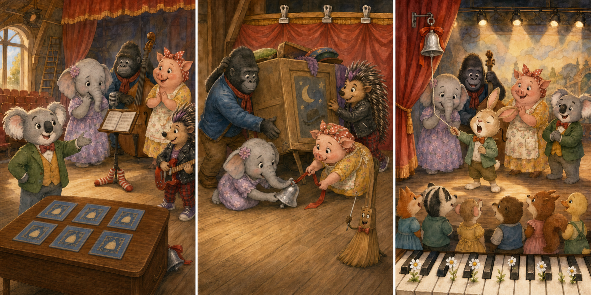

# Sing: The Little Silver Stage Bell

## Part 1: A Quiet Rehearsal

Buster Moon planned a small afternoon show at the theater. It was for young animals who had never been on a stage before. Meena, Johnny, Rosita, and Ash came early to help.

"Today is not about being perfect," Buster said. "It is about feeling brave."

He showed them a little silver bell. The bell usually hung beside the right curtain. One ring meant that a singer was ready to begin.

Meena put six yellow program cards on a table. Johnny moved a music stand to the center of the stage. Rosita checked the lights, and Ash tested a quiet song on her guitar.

Then a loud truck passed outside. The floor shook for a moment. The silver bell fell from its hook and rolled behind a tall box of old costumes.

Buster did not see it happen. A few minutes later, he looked beside the curtain.

"Where is the bell?" he cried. "The new singers need it!"

Meena felt worried. "We can find it," she said. "We still have an hour."

## Part 2: A Sound Behind the Costumes

The friends searched the stage. Johnny looked under the piano. Rosita checked inside two empty drums. Ash moved the yellow program cards, but the bell was not on the table.

Meena stood quietly and listened.

Ting.

"I heard something near the costume box," she said.

The box was too heavy to move. Johnny found two silver clips and used them to hold the long curtain away from the wall. Rosita then saw three chalk arrows on the floor. They pointed behind the box.

Ash lay down and reached into the narrow space. Her hand touched a feather hat, a wooden spoon, and finally a cold metal bell.

"I found it!" she said.

But when she pulled, the bell did not move. Its red ribbon was caught under the box.

The friends worked together. Johnny lifted one corner. Rosita pulled the ribbon, and Meena guided the bell out. Ash held the box steady.

At last, the silver bell was free. It had a small mark, but it still made a clear sound.

Ting!

Buster smiled. "That is the best sound in the theater."

## Part 3: One Brave Note

They hung the bell beside the right curtain again. Soon, six young singers arrived. They looked at the big stage and spoke in nervous voices.

A small rabbit named Pip was first. He held his song paper with both hands.

"I cannot do this," he whispered.

Meena walked over to him. "You only need to sing one note first," she said. "Then you can choose the next one."

Pip looked at the little silver bell. Buster let him ring it himself.

Ting!

The afternoon show began. Pip sang one soft note, then another. His voice became stronger. The other young singers clapped, and Pip finished his whole song.

After the show, Buster placed the bell on a safer hook. Ash tied the red ribbon in a tight knot. Rosita collected the six yellow program cards, and Johnny put away the music stand.

"The bell helped Pip feel ready," Meena said.

Buster shook his head. "The bell helped a little. You helped much more."

Meena smiled. The theater was quiet again, but the happy sound of the young singers seemed to stay in the room.

## Picture Hunt

There are two picture mistakes in each panel. Can you find all six?

## Useful A2 Words

- **rehearsal**: a practice before a show.
- **curtain**: a large piece of cloth that covers a stage.
- **nervous**: worried or afraid about what may happen.

## Reading Questions

1. Where did the silver bell usually hang?
2. What was caught under the costume box?
3. Who sang first in the afternoon show?

## Short Answers

1. It hung beside the right curtain.
2. The bell's red ribbon was caught there.
3. A small rabbit named Pip sang first.
