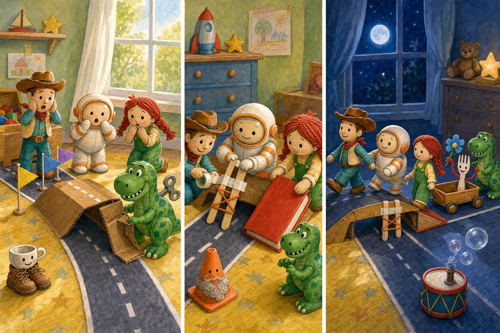

# Toy Story 5: The Cardboard Parade Bridge

## Part 1: Bonnie's Toy Parade

Bonnie built a parade road across her bedroom floor. It began beside the toy box and ended near the window. Five paper flags stood along the road. In the middle, Bonnie made a small bridge from brown cardboard.

"Every toy can join the parade," she said.

She placed Woody at the front, Buzz behind him, and Jessie beside a little toy wagon. Forky sat in the wagon and held a blue paper flower.

Bonnie's mother called her for breakfast. "The parade starts before lunch," Bonnie said as she left the room.

The toys came to life. Woody looked at the cardboard bridge. "We should test the road before Bonnie comes back."

Buzz walked across first. The bridge made a soft bend, but it stayed up.

Then Rex stepped onto it. One cardboard leg folded, and the bridge fell to one side.

"I broke the parade!" Rex cried.

"It was already weak," Jessie said. "We can fix it together."

Woody looked toward the door. They did not have much time.

## Part 2: A Stronger Bridge

Buzz checked the broken leg. "We need something flat and hard."

Jessie found a green book under Bonnie's desk. It was not heavy, and it was wide enough to make a ramp. Woody and Jessie pushed it across the carpet.

Forky searched the craft box. He found two wooden sticks, a roll of white tape, and a short piece of orange string.

"Bridge tools!" he said.

The toys put the two sticks under the cardboard. Buzz held them still while Woody wrapped the white tape around the weak leg. Jessie placed the green book against the bridge, making a gentle ramp.

Rex wanted to help again. This time, he carried the orange string very slowly. The toys tied it between two chair legs as a safety line beside the road.

"Ready for another test," Buzz said.

Woody crossed the bridge. Jessie followed with the empty wagon. The cardboard stayed straight.

Rex took one careful step, then another. The bridge did not move.

"I did not break it!" he said happily.

"You helped make it stronger," Woody told him.

## Part 3: Across the Finish Line

The toys returned to their parade places. Jessie put Forky back in the wagon. Buzz stood behind Woody, and Rex waited after the wagon.

Bonnie came into the room and looked at the bridge. She noticed the green book and the white tape.

"I forgot to make it strong," she said. "This is much better."

She did not know how the bridge was fixed, but she was pleased. She carried the toys to the start of the road.

The parade began before lunch. Woody crossed first. Buzz followed, then Jessie pulled the wagon over the green-book ramp. Forky waved his blue paper flower. Rex walked last and watched every step.

All the toys reached the window safely. Bonnie clapped and moved the five paper flags to the finish line.

"Best parade ever!" she said.

Later, when Bonnie left the room, Rex smiled at the bridge.

"Maybe careful feet are better than fast feet," he said.

Buzz nodded. "A good parade needs a good team."

Woody looked at the repaired cardboard and the toys beside it. The bridge was small, but everyone had helped. That made it strong enough for the whole parade.

## Picture Hunt

There are two picture mistakes in each panel. Can you find all six?

## Useful A2 Words

- **parade**: a line of people or things moving for a special event.
- **fold**: to bend one part over another part.
- **ramp**: a sloping path that joins two different levels.

## Reading Questions

1. How many paper flags stood along the road?
2. What color was the book used as a ramp?
3. When did Bonnie's parade begin?

## Short Answers

1. Five paper flags stood along the road.
2. The book was green.
3. The parade began before lunch.
