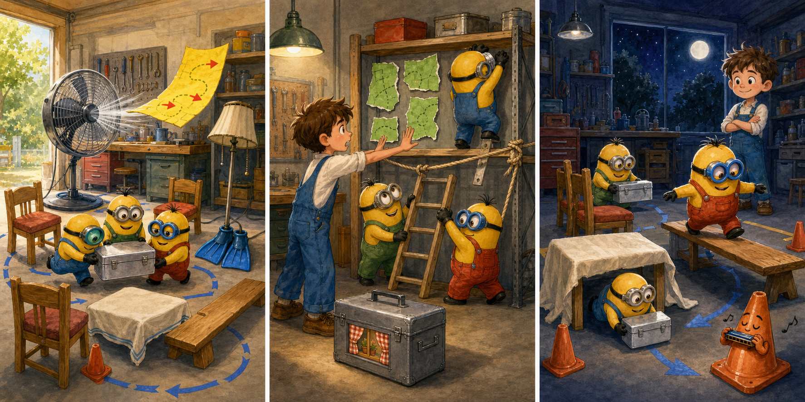

# Minions: The Rise of Gru: The Green Garage Map

## Part 1: Gru's Training Course

Young Gru built a training course in his garage. Kevin, Stuart, and Bob had to carry a silver box around chairs, under a table, and across a wooden board. Gru drew the route on a green map with three red arrows.

"Follow every arrow, and we will finish before dinner," Gru said.

He put the map on a workbench. Bob moved the first chair, while Stuart tested the wooden board. Kevin switched on a large floor fan because the garage was warm.

The wind lifted the green map. It flew across the room, hit a shelf, and disappeared behind it.

Gru looked at the empty workbench. "How can we train without the route?"

## Part 2: Three Pieces

Kevin turned off the fan. The Minions searched carefully. Bob found one piece of green paper under the workbench. Stuart saw another beside a paint tin.

The final piece was behind the shelf. Kevin wanted to climb up at once, but Gru stopped him.

"The shelf may move," Gru said. "We need a safer plan."

They tied a rope around the shelf and held it still. Kevin then used a small ladder to reach behind it. He found the third piece and climbed down slowly.

The map was torn, but all three red arrows were still clear. Gru joined the pieces with tape. Then the Minions placed the chairs, table, and board in the correct order.

## Part 3: A Better Route

The training began again. Kevin carried the silver box around the chairs. Stuart took it under the table, and Bob walked carefully across the wooden board.

This time, nobody rushed. They reached the finish line while the sun still shone through the garage window.

Gru checked the green map. "You followed every arrow," he said proudly.

Bob pointed to the fan and shook his head. Everyone laughed.

Gru placed the map inside a clear folder, where the wind could not take it again. His first plan had failed, but the second plan was safer because everyone had helped to improve it.

## Picture Hunt

There are two picture mistakes in each panel. Can you find all six?

## Useful A2 Words

- **route**: the way from one place to another.
- **shelf**: a flat place for keeping things on a wall or cupboard.
- **improve**: to make something better.

## Reading Questions

1. What caused Gru's map to disappear?
   - A. Bob dropped it while moving a chair.
   - B. The floor fan blew it behind a shelf.
   - C. Stuart carried it under the table.

2. Why did Gru stop Kevin from climbing immediately?
   - A. The shelf needed to be held safely first.
   - B. The ladder was part of the training course.
   - C. The missing paper was already on the floor.

3. What did Gru learn from making the second plan?
   - A. A difficult route should have fewer arrows.
   - B. Training is only successful when it is fast.
   - C. Working together can make a plan safer and better.
