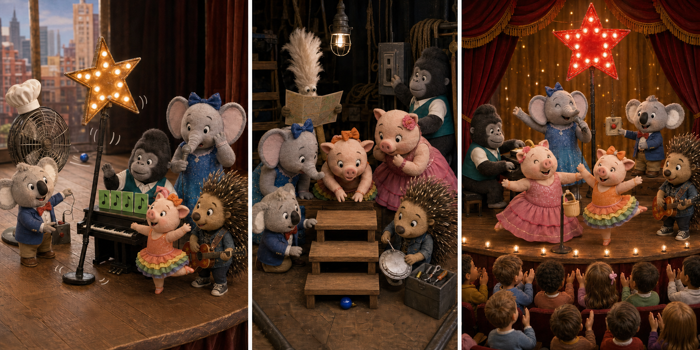

# Sing 2: The Blue Star Light

## Part 1: A Special Rehearsal

Buster Moon planned a short afternoon show in Redshore City. Some children from a nearby school were coming to watch the singers practise. At the end, a blue star light would shine above the stage.

Meena placed four orange music cards beside the piano. Johnny checked the speakers, while Rosita and Gunter practised their dance. Ash helped Buster move the star light onto a tall stand.

Then Gunter turned too quickly and bumped the stand. It stayed up, but the small blue bulb fell out and rolled behind the back curtain. Nobody noticed.

When Buster tested the light, nothing happened.

"We cannot finish the show without our star," he said.

## Part 2: Behind the Curtain

The friends began to search. Johnny looked under the piano, and Rosita checked the costume boxes. Ash found a thin silver line on the floor. It came from the bulb and led toward the curtain.

Behind the curtain, the floor was dark and crowded. Two wooden steps stood near a large stage fan. Meena listened and heard something move when the fan turned.

"Switch it off," Ash said. "Then we can search safely."

Johnny stopped the fan. Gunter held the curtain open while Rosita moved the two steps. The blue bulb was underneath them. It was not broken, but its silver cover was loose.

Ash fixed the cover and placed the bulb back in the star light. This time, a clear blue shape appeared above the stage.

## Part 3: A Bright Ending

The schoolchildren arrived and sat quietly. Meena sang first, Johnny played the piano, and Rosita danced with Gunter. Ash stood near the side of the stage and watched the star light.

At the final note, Buster pressed the button. The blue star shone above everyone. The children clapped and pointed at it.

After the show, Gunter told Buster about bumping the stand.

"I should have been more careful," he said.

Buster smiled. "Yes, but you also helped us find the bulb. That matters too."

The friends put the light in a safer place. They had saved the ending because they listened, worked calmly, and helped one another.

## Picture Hunt

There are two picture mistakes in each panel. Can you find all six?

## Useful A2 Words

- **practise**: to repeat something so you can do it better.
- **crowded**: full of people or things.
- **loose**: not fixed tightly in place.

## Reading Questions

1. Why did the blue star light not work at first?
   - A. Its bulb had fallen behind the curtain.
   - B. Johnny had switched off the speakers.
   - C. Buster had put it on the wrong stand.

2. Why did Ash ask Johnny to stop the stage fan?
   - A. The fan was making the curtain too cold.
   - B. The friends needed to search the area safely.
   - C. The children could hear it from their seats.

3. What did Buster want Gunter to understand?
   - A. Making one mistake can ruin a whole show.
   - B. Telling the truth is more useful than helping.
   - C. Helping to solve a problem is also important.
