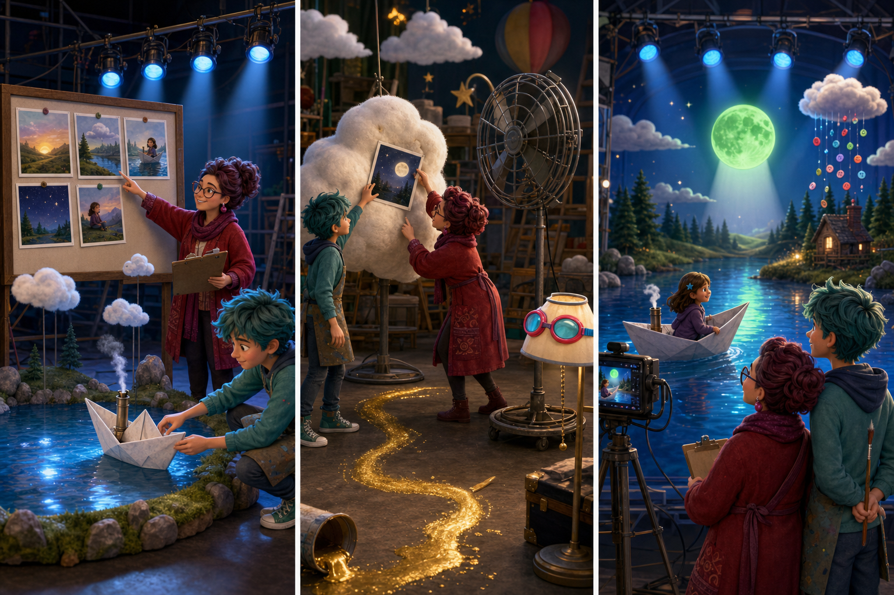

# Dream Productions: The Bent Moon Card

## Part 1: The Missing Ending

Paula Persimmon was directing a peaceful dream for Riley. In the dream, Riley would sail a paper boat across a quiet lake. Three blue lights would shine on the water, and a large silver moon would appear at the end.

Paula placed the story cards in order on a board. Xeni moved the boat and cloud models onto the dream stage. When Paula checked the board again, the final card was missing. It showed when the silver moon should rise.

“We cannot finish the dream without that card,” Paula said. “Riley may stay alone on a dark lake.”

Xeni suggested making a completely different dream, but filming would begin soon. They decided to search the studio first.

## Part 2: A Silver Clue

Paula looked under the story table while Xeni checked the model shelves. Near the door, he noticed a thin line of silver paint on the floor. It led into the daydream room.

Inside, a large cloud model stood beside a tall fan. The missing card was stuck to the back of the cloud. Earlier, the fan had blown it across the studio, and wet silver paint had held it there.

Xeni reached toward the fan, but Paula stopped him. They switched it off before moving the cloud. Then Xeni carefully pulled the card free. They found it, but one corner was badly bent, and the picture of the moon was difficult to see.

## Part 3: A New Moon

Paula worried that there was no time to make another card. Xeni studied the bent picture and had an idea. He painted a new moon on a clear round screen. When they placed a light behind it, a bright silver shape appeared above the lake.

Filming began. Riley sailed past the three blue lights, looked up, and saw the new moon. The dark water became silver, and her paper boat reached the shore. The dream ended quietly, exactly on time.

Paula thanked Xeni for changing the plan without changing the feeling of the story. She put the bent card in a safe folder instead of throwing it away. It reminded them that a damaged plan could still lead to a beautiful ending when people shared their ideas.

## Useful A2 Words

- **direct**: to control how a film or show is made.
- **model**: a smaller copy of an object used to show what it looks like.
- **damaged**: harmed or broken in some way.

## Reading Questions

1. Why did Paula want to find the final story card?
   - A. It explained how Riley's dream should end.
   - B. It showed where Xeni had placed the paper boat.
   - C. It contained the time when filming should begin.

2. How did Paula and Xeni find the missing card?
   - A. They followed silver paint into the daydream room.
   - B. They looked inside every folder near the story table.
   - C. They turned on the fan and watched where the cloud moved.

3. Why did Xeni paint a moon on a clear screen?
   - A. Paula wanted the moon to have a different colour.
   - B. The original card was damaged and there was little time.
   - C. Riley's paper boat could not move under the old moon.

4. What does the whole story suggest about plans?
   - A. A plan should be followed even when it no longer works.
   - B. A simple plan is always better than a creative one.
   - C. People can protect the main idea while changing some details.

## Picture Hunt

There are two picture mistakes in each panel. Can you find all six?

